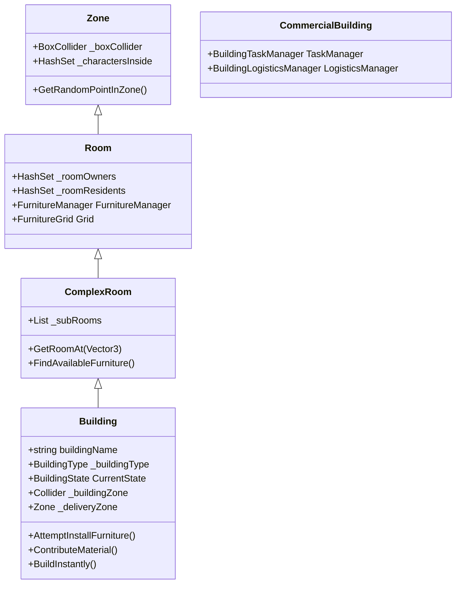

# Building & Zone Architecture

The building system in My-World-Isekai relies on a nested hierarchy of areas that define physical space, track character presence, and manage internal objects like furniture.

## Architectural Hierarchy

### 1. Zone (`Zone.cs`)
The foundational class for any demarcated area.
- **Physical Representation:** Requires a `BoxCollider` and `NavMeshModifierVolume`. 
- **Tracking:** Automatically tracks characters inside (`_charactersInside`) using `OnTriggerEnter` and `OnTriggerExit`.
- **Utility:** Can return random valid NavMesh points within its bounds.

### 2. Room (`Room.cs`)
An enclosed space within the game world.
- **Inheritance:** Inherits from `Zone`.
- **Ownership:** Tracks specific `Owners` and `Residents`.
- **Furniture Management:** Acts as the root for furniture, requiring a `FurnitureManager` and `FurnitureGrid` component. Uses its `BoxCollider` to initialize the bounds of the `FurnitureGrid`.

### 3. ComplexRoom (`ComplexRoom.cs`)
A room that contains smaller nested sub-rooms.
- **Composition:** Maintains a list of sub-`Room`s (`_subRooms`).
- **Recursive Logic:** Overrides character tracking, ownership, and furniture queries to check its own components as well as all nested sub-rooms.

### 4. Building (`Building.cs`)
The top-level structure in the world.
- **Inheritance**: Inherits from `ComplexRoom`. Sub-rooms typically act as the specific floors or separated areas of the building.
- **Management**: Registers itself globally with the `BuildingManager` on `Start()`.
- **Construction & States**: Buildings manage a native `CurrentState` (`BuildingState.UnderConstruction` or `Complete`). They can require `_constructionRequirements` (a list of `CraftingIngredient`s) to be placed. Players/NPCs populate this using `ContributeMaterial(ItemSO, amount)`, which triggers `OnConstructionComplete` when full. Alternatively, `BuildInstantly()` bypasses the requirements.
- **Logistics Integration**: Holds a reference to a `_deliveryZone` which is essential for the Logistics cycle.
- **Public access**: Has an outer `_buildingZone` (distinct from the main interior) for general traversal and random roaming around the property.

### 5. Commercial Building (`CommercialBuilding.cs`)
A specialized structural entity handling jobs and economic tasks.
- **Task Manager (`BuildingTaskManager`)**: Automatically attached module serving as a Blackboard. Manages a pool of `BuildingTask` objects. Instead of workers using expensive polling (raycasts/overlaps), tasks are registered here to be claimed sequentially using OCP-compliant logic (Open/Closed Principle) for dynamic behavior (e.g., Harvesters claiming trees).
- **Logistics Manager (`BuildingLogisticsManager`)**: Automatically attached module handling the supply chain data, inventory checks, and order queues (BuyOrders, CraftingOrders, TransportOrders). Separated from the worker (`JobLogisticsManager`) to ensure data persists.

---

## The Furniture System

The interior of a `Room` is subdivided into a logical grid where objects can be placed.

### FurnitureGrid (`FurnitureGrid.cs`)
Provides a discrete coordinate system over a room's `BoxCollider`.
- **Initialization:** Determines grid bounds (`_gridWidth`, `_gridDepth`) using the room's collider size and a defined `_cellSize` (typically 1 unit = 1m).
- **Placement Validation:** Checks collision boundaries using `CanPlaceFurniture()`. It verifies that points do not fall out of bounds or overlap with existing occupied cells.
- **Pathfinding:** Works alongside NavMesh but focuses purely on discrete object placement logic.

### Furniture (`Furniture.cs`)
The base class for interactable or static objects inside rooms.
- **Space Occupation:** Holds a `_sizeInCells` (Vector2Int) dictating how many grid cells it consumes. This is often auto-calculated via renderer bounds.
- **Interaction Point:** Dictates where characters must stand to interact with it (`_interactionPoint`).
- **Availability State:** 
  - `_reservedBy`: A character is walking to it.
  - `_occupant`: A character is currently using it physically.
  - Both prevent other characters from using the furniture simultaneously.

## Best Practices
- Always ensure `Zone` colliders have `isTrigger = true` and perfectly encapsulate their interior visual meshes, as their size dictates the generated `FurnitureGrid`.
- Query `Furniture` availability starting from the `ComplexRoom` or `Building` level to let recursive logic find the nearest or first-available furniture in the entire property.
- When an NPC needs to drop items off or use the shop, rely on the properties like `_deliveryZone` stored natively on the `Building` component.

---

## Building Placement System

Player and NPC building placement follows a shared validation pipeline.

### Key Files
| File | Purpose |
|---|---|
| `BuildingPlacementManager.cs` | Ghost visual, mouse positioning, validation, `RequestPlacementServerRpc` |
| `UI_BuildingPlacementMenu.cs` | Lists unlocked blueprints, instant mode toggle |
| `UI_BuildingEntry.cs` | Single entry row: icon + name + click handler |
| `CharacterBlueprints.cs` | Stores `UnlockedBuildingIds` and `MaxPlacementRange` |
| `WorldSettingsData.cs` | `BuildingRegistry` (PrefabId → BuildingPrefab mapping) |

### Placement Flow (Player)
1. Player opens `UI_BuildingPlacementMenu` via the HUD "Build" button.
2. Selects a building → `BuildingPlacementManager.StartPlacement(prefabId)`.
3. Ghost prefab follows mouse cursor (raycast on `_groundLayer`).
4. Ghost material changes (valid = green, invalid = red) based on `ValidatePlacement()`.
5. **Left-Click** confirms → `RequestPlacementServerRpc` spawns the building server-side.
6. **Right-Click / Escape** cancels placement.

### Validation Rules
- **Range**: `Vector3.Distance(character, target) <= CharacterBlueprints.MaxPlacementRange`.
- **Obstacle overlap**: `Physics.OverlapBox` using the building's `BuildingZone` collider against `_obstacleLayer`.
- `ValidatePlacement(Vector3)` is **public** so NPC AI systems can call it directly.

### Instant Build Mode
- Toggled via `SetInstantMode(bool)` on `BuildingPlacementManager`.
- UI exposes this as a `Toggle` in the placement menu.
- When active, the ServerRpc calls `building.BuildInstantly()` after spawning, bypassing construction requirements.

### State Management & Interactions
Building mode is integrated into the core `Character` state machine to ensure consistency:
- **Character State**: `Character.IsBuilding` flag and `OnBuildingStateChanged` event.
- **Busy Logic**: When building, `Character.IsFree()` returns `false` with `CharacterBusyReason.Building`. This prevents overlapping actions (e.g. starting a craft while placing).
- **Auto-Interruption**: `BuildingPlacementManager` inherits from `CharacterSystem`. It automatically calls `CancelPlacement()` if the character enters combat or becomes incapacitated.
- **UI Sync**: `UI_BuildingPlacementMenu` subscribes to `OnBuildingStateChanged`. If the state is cancelled externally (combat), the menu automatically closes.

### Camera Integration
The camera system reacts to building state changes for improved UX:
- **Auto Zoom**: When a character enters building mode, `CameraFollow` smoothly zooms out to the maximum allowed distance (`_targetZoom = 1f`).
- **Scroll Lock**: Manual mouse wheel zoom is disabled during placement to prevent accidental perspective shifts.
- **Restore Zoom**: Upon exiting building mode (completion or cancellation), the camera restores the previous zoom level.

### Server Authority
- The ghost is client-local only (NetworkObject disabled on the ghost prefab).
- Actual building spawn happens exclusively on the Server via `RequestPlacementServerRpc`.
- The Server re-validates the prefab ID against `WorldSettingsData.BuildingRegistry` before instantiation.
