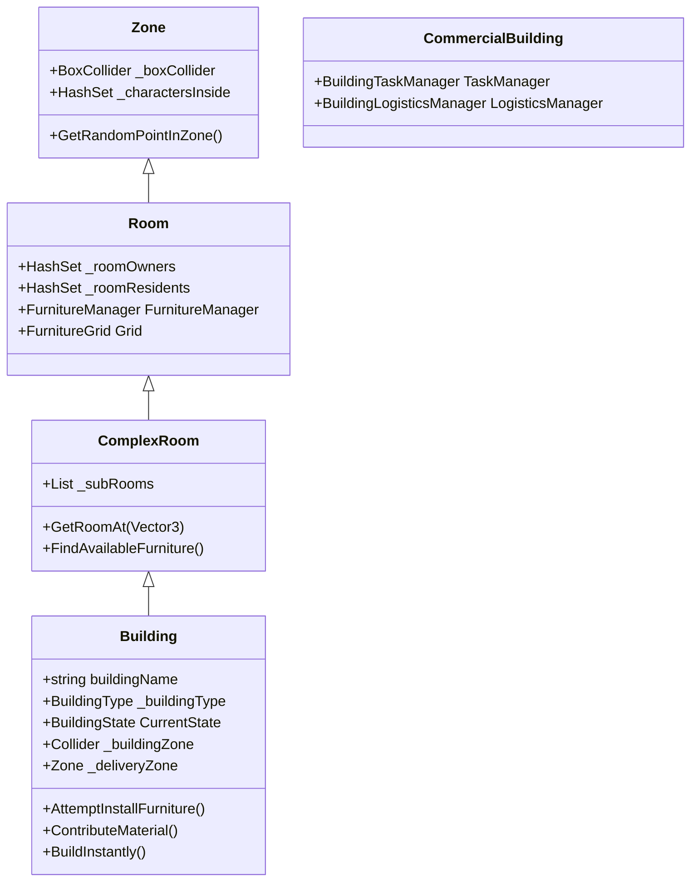

# Building & Zone Architecture

The building system in My-World-Isekai relies on a nested hierarchy of areas that define physical space, track character presence, and manage internal objects like furniture.

## Architectural Hierarchy



### 1. Zone (`Zone.cs`)
The foundational class for any demarcated area.
- **Physical Representation:** Requires a `BoxCollider` and `NavMeshModifierVolume`. 
- **Tracking:** Automatically tracks characters inside (`_charactersInside`) using `OnTriggerEnter` and `OnTriggerExit`.
- **Utility:** Can return random valid NavMesh points within its bounds.

### 2. Room (`Room.cs`)
An enclosed space within the game world.
- **Inheritance:** Inherits from `Zone`.
- **Ownership:** Tracks specific `Owners` and `Residents`.
- **Furniture Management:** Acts as the root for furniture, requiring a `FurnitureManager` and `FurnitureGrid` component. Uses its `BoxCollider` to initialize the bounds of the `FurnitureGrid`.

### 3. ComplexRoom (`ComplexRoom.cs`)
A room that contains smaller nested sub-rooms.
- **Composition:** Maintains a list of sub-`Room`s (`_subRooms`).
- **Recursive Logic:** Overrides character tracking, ownership, and furniture queries to check its own components as well as all nested sub-rooms.

### 4. Building (`Building.cs`)
The top-level structure in the world.
- **Inheritance**: Inherits from `ComplexRoom`. Sub-rooms typically act as the specific floors or separated areas of the building.
- **Management**: Registers itself globally with the `BuildingManager` on `Start()`.
- **Construction & States**: Buildings manage a native `CurrentState` (`BuildingState.UnderConstruction` or `Complete`). They can require `_constructionRequirements` (a list of `CraftingIngredient`s) to be placed. Players/NPCs populate this using `ContributeMaterial(ItemSO, amount)`, which triggers `OnConstructionComplete` when full. Alternatively, `BuildInstantly()` bypasses the requirements.
- **Logistics Integration**: Holds a reference to a `_deliveryZone` which is essential for the Logistics cycle.
- **Public access**: Has an outer `_buildingZone` (distinct from the main interior) for general traversal and random roaming around the property.
- **Dynamic Identity**: Buildings expose a unique `NetworkBuildingId` GUID used to link the building to its interior map record (`BuildingInteriorRegistry`) and any persisted state. **Generation strategy is split by origin:**
  - **Scene-authored buildings** (no `PlacedByCharacterId`): `OnNetworkSpawn` derives a *deterministic* GUID from `MD5(scene name + world position rounded to mm)` so the same scene building keeps the same `BuildingId` across reloads — without this, every reload would generate a fresh ID and orphan the saved interior record.
  - **Runtime-placed buildings** (`BuildingPlacementManager`): `BuildingPlacementManager.RequestPlacementServerRpc` sets `PrefabId` + `PlacedByCharacterId` **before** `netObj.Spawn()` so they ride in the initial NetworkVariable payload AND are observable inside `Building.OnNetworkSpawn`. With `PlacedByCharacterId` non-empty, `OnNetworkSpawn` rolls a fresh `Guid.NewGuid()` — that GUID then round-trips through `BuildingSaveData` on save.
- **Prefab ID**: The `PrefabId` string is used for registry lookups in `WorldSettingsData` but is NOT unique per instance.

### 5. Commercial Building (`CommercialBuilding.cs`)
A specialized structural entity handling jobs and economic tasks.

#### Furniture-reference resolution (three-tier lazy-rebind, 2026-05-02)

`ToolStorage`, `HelpWantedSign`, and `ManagementFurniture` are virtual properties with a three-tier resolver. Designers don't have to assign anything in the inspector for `ToolStorage` — by default the building's first `StorageFurniture` child becomes the tool storage. Resolution order:

1. **Cached field still alive** — return the field directly when the reference is non-null.
2. **Snapshot-based rebind** — `Awake` snapshots the inspector-assigned furniture's `(FurnitureItemSO + buildingLocalPosition)` BEFORE `base.Awake` runs `ConvertNestedNetworkFurnitureToLayout` (which destroys the original nested children). The lazy resolver then scans children for the closest `(SO, localPos)` match within `FurnitureRefMatchEpsilon` and rebinds. Pattern lives in `CommercialBuilding.ResolveLazyFurnitureRef<T>`.
3. **First-crate convention fallback** (`ToolStorage` only) — `GetComponentInChildren<StorageFurniture>(includeInactive: false)`. The first storage child wins.

`ToolStorage` returns null only when the building has no `StorageFurniture` children at all, in which case `HasToolStorage` is false and tool-needing GOAP actions (`GoapAction_FetchToolFromStorage`, `GoapAction_ReturnToolToStorage`) fail-cleanly.

**`virtual IEnumerable<ItemSO> GetToolStockItems()` extension point.** Default yields nothing. Override on subclasses that own tools — `FarmingBuilding` yields its `WateringCanItem`. When a `JobLogisticsManager` worker drops off an item matching one of these and `ToolStorage` is available, the deposit is redirected from the loose `StorageZone` into the tool storage furniture. `IsBuildingToolItem(ItemSO)` is the membership-check classifier wired into `FindStorageFurnitureForItem` and `GoapAction_GatherStorageItems.DetermineStoragePosition`.
- **Task Manager (`BuildingTaskManager`)**: Automatically attached module serving as a Blackboard. Manages a pool of `BuildingTask` objects. Instead of workers using expensive polling (raycasts/overlaps), tasks are registered here to be claimed sequentially using OCP-compliant logic (Open/Closed Principle) for dynamic behavior (e.g., Harvesters claiming trees).
- **Logistics Manager (`BuildingLogisticsManager`)**: Automatically attached **facade** over three plain-C# collaborators (`LogisticsOrderBook`, `LogisticsTransportDispatcher`, `LogisticsStockEvaluator`, all under `Assets/Scripts/World/Buildings/Logistics/`). The public API on the facade is stable — external callers (`JobLogisticsManager`, `InteractionPlaceOrder`, `GoapAction_PlaceOrder`, etc.) do not know about the split. Sub-components are reachable via `OrderBook`, `Dispatcher`, `Evaluator` properties for tests/tooling. See [`logistics-cycle` SKILL](../logistics_cycle/SKILL.md) for the order lifecycle, policy SO, and diagnostics details.
- **Stocking contract (`IStockProvider`)**: Any `CommercialBuilding` that wants autonomous restock implements `IStockProvider.GetStockTargets()`, returning `(ItemSO, MinStock)` pairs. The evaluator reads these on every `OnWorkerPunchIn` and places `BuyOrder`s when the virtual stock (physical + in-flight) falls below the pluggable `LogisticsPolicy`'s reorder threshold. Shipping implementers: `ShopBuilding` (projects `_itemsToSell`) and `CraftingBuilding` (`_inputStockTargets` — authored per-prefab in the Inspector, was added by the Layer A fix that stopped idle forges from sitting on empty input bins).

---

## The Furniture System

The interior of a `Room` is subdivided into a logical grid where objects can be placed.

### FurnitureGrid (`FurnitureGrid.cs`)
Provides a discrete coordinate system over a room's `BoxCollider`.
- **Initialization:** Determines grid bounds (`_gridWidth`, `_gridDepth`) using the room's collider size and a defined `_cellSize` (fixed at 1 unit = 1m).
- **Serialization:** Grid data (`_gridWidth`, `_gridDepth`, `_gridOrigin`, `_cells`) is serialized into the prefab via `[ContextMenu("Initialize Furniture Grid")]`. At runtime, `RestoreFromSerializedData()` rebuilds the 2D array from the flat list and recalculates cell world positions from the current transform (handles interior offset at y=5000).
- **Client sync:** On clients, `Awake()` fires before NGO sets the network position. `Room.OnNetworkSpawn()` calls `RestoreFromSerializedData()` again so the grid origin matches the actual runtime position. Without this, the grid is anchored at the prefab's origin (0,0,0) instead of the interior offset.
- **Placement Validation:** `CanPlaceFurniture()` checks: cell in bounds, not occupied, not IsWall, cell corners within BoxCollider bounds. The bounds Y-check uses `roomBounds.center.y` to avoid rejection by flat (height=0) colliders.
- **Ghost Snapping:** `GetPlacementPositions(cursorPos, sizeInCells)` returns grid-snapped anchor + visual center. Clamps the furniture footprint to grid bounds so it can't extend outside. The anchor is used for grid validation/registration, the visual center for ghost rendering.
- **Pathfinding:** Works alongside NavMesh but focuses purely on discrete object placement logic.

### Furniture registration / lazy bootstrap

`Room.Awake()` calls `FurnitureManager.LoadExistingFurniture()` to populate `Furnitures` from children. The scan uses `GetComponentsInChildren<Furniture>(true)` (includes inactive GameObjects). Because nested-prefab children can still be late-parented or late-activated — especially for network-spawned buildings where `NetworkObject` children arrive after the parent's Awake — `LoadExistingFurniture()` is **re-invoked in `Room.Start()` and `Room.OnNetworkSpawn()`**.

`Building.Start` ALSO calls `MainRoom.FurnitureManager.LoadExistingFurniture()` explicitly (2026-05-02). `Room.Start` runs the same defensive rescan but is `private`, so without the explicit call the Building's own MainRoom rescan never happened — the Building class itself IS its `MainRoom` via `ComplexRoom` inheritance, but the inherited `Start` method was hidden by `Building.Start`'s own override. Critical for spawned default furniture: `SpawnDefaultFurnitureSlot` parents furniture under the building root (NGO requires a NetworkObject ancestor), and the default-to-MainRoom registration (see below) relies on this rescan to catch any earlier authoring path that skipped it.

**The call is additive, not replace-style.** Each invocation prunes Unity fake-null entries, then merges any newly-discovered transform child into `_furnitures` (skipped if already present). The grid registration on top of that is itself idempotent (`FurnitureGrid.RegisterFurniture` just writes `cell.Occupant`). This matters because `CommercialBuilding._defaultFurnitureLayout` registers spawned furniture into `_furnitures` via `RegisterSpawnedFurnitureUnchecked` **without parenting it under the room** (the furniture sits on the building root — see "Default furniture spawn" below). A replace-style rescan would silently wipe those registrations: the room's transform tree never contained them, so `GetComponentsInChildren` returns an empty set and the list would collapse on the next `Start` / `OnNetworkSpawn` re-invocation.

This bootstrap matters because `CraftingBuilding.GetCraftableItems()` walks `Rooms → FurnitureManager.Furnitures → station.CraftableItems`. If the list is empty, `ProducesItem(item)` returns false for every item and `LogisticsStockEvaluator.FindSupplierFor` can't route to the building. `GetCraftableItems` carries a transform-tree fallback (`GetComponentsInChildren<CraftingStation>` on the building) that recovers crafting capability when the room list is empty AND emits a one-shot warning — so a regression to replace-style would be caught loudly even if it didn't break crafting outright. Any other system that queries a room's furniture at runtime depends on the same `_furnitures`-list invariant.

> **Note:** The additive note above refers to `Building._defaultFurnitureLayout` (hoisted from `CommercialBuilding` — now lives on the base `Building` class and applies to all subclasses).

### Furniture (`Furniture.cs`)
The base class for interactable or static objects inside rooms.
- **Space Occupation:** Holds a `_sizeInCells` (Vector2Int) dictating how many grid cells it consumes. This is often auto-calculated via renderer bounds.
- **Interaction Point:** Dictates where characters must stand to interact with it (`_interactionPoint`).
- **Availability State:** 
  - `_reservedBy`: A character is walking to it.
  - `_occupant`: A character is currently using it physically.
  - Both prevent other characters from using the furniture simultaneously.

#### Typed subclasses
- **`ChairFurniture` / `ChairFurnitureInteractable`** — sit-and-stay seating; Release() ends occupation.
- **`CraftingStation` + `CraftingFurnitureInteractable`** — opens the crafting window for a worker.
- **`TimeClockFurniture` + `TimeClockFurnitureInteractable`** — punch-in / punch-out station for the parent `CommercialBuilding`. Acts as a one-shot interaction: `Furniture.Use(...)` → `Action_PunchIn` / `Action_PunchOut` → `Furniture.Release()` fires in the action's `OnActionFinished`. Players hop through `CommercialBuilding.RequestPunchAtTimeClockServerRpc` (client-side `Interact` detects `!IsServer` and routes); NPCs target the clock from `BTAction_Work` / `BTAction_PunchOut` directly on the server. Eligibility: the interactor must have a `JobAssignment` where `Workplace == this building`. Missing clock → one-shot warning + legacy zone-punch fallback.
- **`StorageFurniture`** — slot-based container (chest, shelf, barrel, wardrobe). Mirrors the player `Inventory` pattern: a flat `List<ItemSlot>` initialized from four authored capacity ints (`_miscCapacity`, `_weaponCapacity`, `_wearableCapacity`, `_anyCapacity`). API: `AddItem(ItemInstance)`, `RemoveItem`, `RemoveItemFromSlot`, `GetItemSlot(int)`, `HasFreeSpaceFor*`, plus `Lock()` / `Unlock()` and `OnInventoryChanged` event. `AddItem` uses **strict-first slot priority** — wearables try `WearableSlot → MiscSlot → AnySlot`, weapons try `WeaponSlot → AnySlot`, everything else `MiscSlot → AnySlot` — so dedicated typed slots fill before generic ones. New slot types `WearableSlot` (wearables only) and `AnySlot` (any item) live alongside the existing `MiscSlot` / `WeaponSlot`. **Storage contents are now server-authoritative replicated** — see "Storage network sync" below. **Visual display is opt-in** via the optional `StorageVisualDisplay` component (see below) — chests don't add it, shelves do.

#### Storage network sync (`StorageFurnitureNetworkSync`)
Sibling `NetworkBehaviour` added to `Assets/Prefabs/Furniture/Storage/Storage.prefab` (and inherited by every variant: `Storage Visible Items.prefab`, `Crate.prefab`). Reuses the `NetworkObject` already on the `Furniture_prefab` base — no separate `NetworkObject` is added on the storage GameObject (rule: never nest a second `NetworkObject` on a runtime-spawned prefab; see `wiki/gotchas/host-progressive-freeze-debug-log-spam.md` neighbours).

- Holds `NetworkList<NetworkStorageSlotEntry>` — each entry is `{ ushort SlotIndex, FixedString64Bytes ItemId, FixedString4096Bytes JsonData }`. Sparse: empty slots are simply absent from the list.
- **Server-side flow:** `OnNetworkSpawn` (server) subscribes to `_storage.OnInventoryChanged` and runs an initial `RebuildNetworkListFromStorage` so the list is in sync the moment NGO finishes the spawn handshake. Each subsequent inventory change clears the list and re-adds one entry per non-empty slot. Strict-first slot priority logic still runs only inside `StorageFurniture.AddItem` on the server — the sync layer just snapshots the result.
- **Client-side flow:** `OnNetworkSpawn` (client) subscribes to `OnListChanged` AND immediately calls `ApplyFullStateOnClient` for late-joiner safety. Each `OnListChanged` event (any `EventType` — `Add`, `Insert`, `Value`, `Remove`, `RemoveAt`, `Clear`, `Full` — see `feedback_network_client_sync.md` and `.agent/skills/multiplayer/SKILL.md` §8 on the NetworkList event-type fan-out gotcha) triggers a full rebuild of the local slot state via `StorageFurniture.ApplySyncedSlotsFromNetwork`. That method clears every slot and writes the supplied entries by index, then fires the local `OnInventoryChanged` so `StorageVisualDisplay` re-renders on this peer.
- **`ItemSO` resolution** mirrors `WorldItem.ApplyNetworkData`: `Resources.LoadAll<ItemSO>("Data/Item")` → `Array.Find` by `ItemId` → `so.CreateInstance()` → `JsonUtility.FromJsonOverwrite` → re-bind `instance.ItemSO = so` (lost during JSON overwrite). Each step is wrapped in `try/catch` per rule #31 — one bad entry never blocks the rest.
- **Spawn-timing invariant:** `StorageFurniture._itemSlots` is built in `Awake()` (capacities authored on the prefab). `Awake` runs before the first `OnNetworkSpawn` call on the same GameObject, so the server's initial rebuild always sees a fully-initialized slot list. Client capacity is computed identically from the same authored ints, so server and client agree on slot count from frame 0.
- **What still lives only server-side:** `IsLocked` (the `Lock()` / `Unlock()` flag). If lock state ever needs to be visible to clients, extend the sync component — do not lift the lock check into `ApplySyncedSlotsFromNetwork`.
- **Cost:** O(Capacity) per server-side mutation. With the authored Crate capacity (32 slots) this is fine. NetworkList delta-sync sends one `Clear` event followed by one `Add` per non-empty entry, so a single mutation produces 1+N events on the wire and 1+N rebuilds on the client. Visual flicker is per-mutation only and invisible at typical storage churn rates. If profiling later shows hot churn, replace the clear+rebuild with a delta diff.
- **Multiplayer test plan (rule #19):** validated across (a) Host stores via `StorageFurniture.AddItem` → all clients see the item; (b) Client triggers a server-side store via NPC AI / `CharacterStoreInFurnitureAction` → server runs `AddItem`, sync layer fires, every other client mirrors; (c) Host↔NPC: NPC store on host fires the same path, every client (including host) sees the item.

#### Storage save/restore (`BuildingSaveData.StorageFurnitures`)
Slot contents survive `MapController.Hibernate` / `WakeUp` AND game-session reloads via per-furniture entries on `BuildingSaveData`. The schema lives in [MapRegistry.cs](../../Assets/Scripts/World/MapSystem/MapRegistry.cs) and the restore wiring lives in [MapController.cs](../../Assets/Scripts/World/MapSystem/MapController.cs).

- **Save-side (`BuildingSaveData.FromBuilding`):** walks `building.GetFurnitureOfType<StorageFurniture>()` (recurses through every sub-room because `Building` extends `ComplexRoom`). For each storage, builds a `StorageFurnitureSaveEntry { FurnitureKey, List<StorageSlotSaveEntry> Slots }` keyed by `BuildingSaveData.ComputeStorageFurnitureKey(storage, building.transform)`. Each non-empty slot contributes a `StorageSlotSaveEntry { SlotIndex, ItemId, JsonData }` — same `JsonUtility.ToJson(ItemInstance)` recipe the network-sync layer uses. Per-slot try/catch: a single corrupt instance is logged and skipped, never blocks the rest of the save (rule #31). The entry is added even when `Slots` is empty so that emptying a previously-stocked storage actually persists the empty state on the next save.
- **Restore-side (`MapController.RestoreStorageFurnitureContents`):** invoked from BOTH `SpawnSavedBuildings` (predefined-map load + `RespawnDynamicMaps`) and `WakeUp` (post-hibernation). Runs immediately after the building's `bNet.Spawn()` returns — `CommercialBuilding.OnNetworkSpawn` synchronously fires `TrySpawnDefaultFurniture` which synchronously instantiates+spawns each storage furniture, so live storages exist by the time restore runs. The method walks `building.GetFurnitureOfType<StorageFurniture>()`, looks up each storage's entry by composite key, rehydrates each slot's `ItemInstance` via `Resources.LoadAll<ItemSO>("Data/Item")` → `Array.Find` by ItemId → `so.CreateInstance()` → `JsonUtility.FromJsonOverwrite` → re-bind `inst.ItemSO = so` (same pattern as `StorageFurnitureNetworkSync.TryDeserializeEntry`), and pushes the result through `StorageFurniture.RestoreFromSaveData`. Per-slot AND per-furniture try/catch — one corrupt entry never blocks others (rule #31).
- **FurnitureKey scheme:** `"{FurnitureItemSO.ItemId}@{x:F2},{y:F2},{z:F2}"` formatted with `CultureInfo.InvariantCulture`, where (x,y,z) is `building.transform.InverseTransformPoint(storage.transform.position)`. Stable across `_defaultFurnitureLayout` reorders, supports multiple same-typed storages per building, locale-independent. The static helper `BuildingSaveData.ComputeStorageFurnitureKey` is the single authority used by BOTH save and restore so they cannot drift.
- **Network sync interaction:** `StorageFurniture.RestoreFromSaveData` ends by firing `OnInventoryChanged`. The sibling `StorageFurnitureNetworkSync` is already subscribed (subscribed in its server-side `OnNetworkSpawn`, which ran inside the same synchronous spawn-handshake chain), so `RebuildNetworkListFromStorage` runs immediately and rewrites the replicated `NetworkList`. **Late-joining clients see populated state on connect with no extra restore-side networking.** No race: by the time `RestoreFromSaveData` is called, the storage's `OnNetworkSpawn` has already returned and the subscription is live.
- **Backward compatibility:** `BuildingSaveData.StorageFurnitures` defaults to an empty list, so save files written before this feature deserialize cleanly (the missing field is treated as an empty list, restore is a no-op for those buildings). No migration code needed.

**Adding a new storage subclass:** if you subclass `StorageFurniture` (e.g. `EncryptedChest` with a passcode field), the save/restore path picks it up automatically because the discovery is via `GetFurnitureOfType<StorageFurniture>()` and the serialization is per-slot. The **only** thing to add is subclass-specific state — for example, persisting a passcode would need a new field on `StorageFurnitureSaveEntry` plus subclass-aware capture/apply logic. Slot contents themselves require no change. Do NOT route subclass-specific state through `RestoreFromSaveData(IReadOnlyList<(int, ItemInstance)>)` — that contract is intentionally narrow ("clear and write slots, fire one event"); add a separate API on the subclass (mirroring how `IsLocked` will eventually be handled).

**Authoring rule for storages with `_defaultFurnitureLayout`:** the FurnitureKey depends on the storage's building-local position. If you change `LocalPosition` on a `_defaultFurnitureLayout` slot **after** a world save was written, the saved entry's key won't match any live storage on next load — its contents will be silently dropped. This is the same brittleness as renaming a save field. Treat `_defaultFurnitureLayout` slot positions as part of the save schema once a build ships.

#### `StorageVisualDisplay` (optional renderer)
Add this component next to `StorageFurniture` only when contents should be visible (shelves, open crates, weapon racks). Configure:
- `_displayAnchors` — `List<Transform>`. Anchors are consumed by the **first non-empty slots iterated in slot order** (misc → weapon → wearable → any), so a shelf with 5 anchors over an 8-misc + 8-wearable storage will display the first 5 stored items regardless of slot index. Authors don't need to match anchor count to capacity — extras stay unused; fewer-than-capacity is fine.
- `_itemScale` — uniform scale applied to each spawned item visual (default 0.7). Items are usually authored at full world size; shelves want them shrunk.

**Visual pipeline mirrors `WorldItem.Initialize` directly** but instantiates `ItemSO.ItemPrefab` (the visual sub-prefab) instead of the full `WorldItemPrefab` wrapper:
1. Instantiate `ItemSO.ItemPrefab` — the same content `WorldItem.AttachVisualPrefab` uses internally as the inner visual. Pure visuals, no `NetworkObject`, no `NetworkTransform`, no physics.
2. Add a `SortingGroup` to the spawned root if it doesn't already have one — this is the only thing the `WorldItemPrefab` wrapper provided beyond raw visuals, and 2D sprites need it to layer correctly against the rest of the building.
3. `StripRuntimeComponents`: disable `Collider`s, `Rigidbody.isKinematic = true` + `useGravity = false`, disable `NavMeshObstacle`s. Static shelf items can't push workers, fall, or carve the navmesh.
4. Reparent + zero local transform + apply `_itemScale`.
5. `ApplyItemVisual` — same wearable-handler / simple-item config logic as `WorldItem.Initialize`: find `WearableHandlerBase` in children → `Initialize(SpriteLibraryAsset)` + `SetLibraryCategory(CategoryName)` + primary/secondary colors from the `EquipmentInstance` + `SetMainColor(Color.white)`. Else `ItemInstance.InitializeWorldPrefab(go)` for simple items (apple, potion). Re-applies `ShadowCastingMode` from `ItemSO.CastsShadow` to every Renderer.

**Critical client-side gotcha:** earlier versions instantiated `WorldItemPrefab` (the full wrapper with a `NetworkObject`). On the host, NGO tolerated the "homeless" cloned `NetworkObject` long enough to `DestroyImmediate` it. **On clients, NGO's stricter spawn-tracking either reverted parenting or left the GameObject in a non-rendering state** — visuals never appeared. The `ItemPrefab` approach has zero `NetworkObject`s in the cloned chain, so there's nothing for NGO to interfere with on either peer. Same reason applies whenever you clone a prefab purely for visual purposes — never include the `NetworkObject` in the clone if you don't intend to `Spawn()` it.

Performance contract:
- Per-`ItemSO` object pool (`Dictionary<ItemSO, Stack<GameObject>>`) — taking and re-storing the same item type doesn't allocate after the first time. Different SOs never share a pooled instance. `InitializeWorldPrefab` runs only on first spawn (color injection on a sprite that already has it would be wrong); wearable handlers re-apply per-acquire because `EquipmentInstance` palettes can differ.
- Event-driven via `StorageFurniture.OnInventoryChanged`; no `Update` loop, no coroutines.
- Static items don't run physics / pathfinding — the strip pass guarantees this.
- **No distance gating today.** A coroutine-based squared-distance check was removed because it was a global host-side decision that flipped client displays out of phase with the storage state. Per-peer local culling is tracked in [`wiki/projects/optimisation-backlog.md`](../../wiki/projects/optimisation-backlog.md) for future work.

`StorageVisualDisplay` is network-agnostic. As of the `StorageFurnitureNetworkSync` work it correctly receives `OnInventoryChanged` on every peer (host and clients), because the sync layer fires the local event at the end of `ApplySyncedSlotsFromNetwork`. No display-side authority checks needed — the display just listens to the local event regardless of who's running.

#### Logistics-cycle integration
`CommercialBuilding` exposes two helpers used by GOAP actions to prefer slot storage over the loose `StorageZone` drop:
- `FindStorageFurnitureForItem(ItemInstance)` — first-fit search across all sub-rooms (via `GetFurnitureOfType<StorageFurniture>()`); returns the first unlocked furniture with a compatible free slot, or null. Type-affinity (a wardrobe rejecting a sword) falls out of `StorageFurniture.HasFreeSpaceForItem` for free.
- `GetItemsInStorageFurniture()` — yields every `(furniture, item)` pair currently held in any storage slot. Used by the outbound staging path so reserved transport instances stored as logical-only slot data can still be located.

Two character actions wire the slot transfer:
- `CharacterStoreInFurnitureAction(character, item, furniture)` — removes the item from the worker's inventory or hands and inserts it into the slot. **No `WorldItem` is spawned** — the item lives logical-only inside the slot. Re-validates lock + free-space at `OnApplyEffect` (another worker may have filled the slot during travel) and rolls back to hands on slot-insert failure.
- `CharacterTakeFromFurnitureAction(character, item, furniture)` — mirror; pulls the item out of the slot and places it in the worker's hands. Used by `GoapAction_StageItemForPickup` when a reserved instance is in a slot rather than a loose `WorldItem`.

`GoapAction_GatherStorageItems` (LogisticsManager inbound) tries furniture first and re-targets per-item across multiple furniture pieces; falls back to the zone drop when nothing fits. `GoapAction_DepositResources` (harvester) only opportunistically diverts to a furniture within ~5 Unity units (≈0.76 m) of the deposit zone — preserves throughput. `GoapAction_StageItemForPickup` (outbound) checks slot-stored reserved instances after the loose-WorldItem scan. **Transporter pickup also runs furniture-first**: `GoapAction_LocateItem` scans `GetItemsInStorageFurniture()` before the WorldItem search; on a hit it sets new `JobTransporter.TargetSourceFurniture` + `TargetItemFromFurniture` fields and the new `GoapAction_TakeFromSourceFurniture` walks the worker straight to the slot — bypassing the LogisticsManager staging dance entirely. `GoapAction_MoveToItem` and `GoapAction_PickupItem` early-out when `TargetSourceFurniture != null` so the two pickup paths are mutually exclusive. See `.agent/skills/logistics_cycle/SKILL.md` for the full state-machine diff.

**`RefreshStorageInventory` guard**: Pass 1 (the ghost-detector) builds a `furnitureStoredInstances` HashSet from `GetItemsInStorageFurniture()` and skips any logical instance present in it. Without this protection, every furniture-stored item would be silently ghosted on the next punch-in (no matching `WorldItem` in `StorageZone` → flagged as ghost → removed from `_inventory`).

### Furniture Placement & Pickup (Player + NPC)

Furniture has two forms:
- **Portable:** `FurnitureItemSO` (ScriptableObject in `Resources/Data/Item/`) + `FurnitureItemInstance` (carried in hands as a crate)
- **Installed:** `Furniture` MonoBehaviour (placed on grid or freestanding)

Bidirectional link: `FurnitureItemSO._installedFurniturePrefab` → Furniture prefab; `Furniture._furnitureItemSO` → back to `FurnitureItemSO`.

#### Placement Flow
- **Player:** Carries `FurnitureItemInstance` in hands → presses F → `FurniturePlacementManager` shows ghost → left-click confirms → queues `CharacterPlaceFurnitureAction`
- **NPC:** AI decision → queues `CharacterPlaceFurnitureAction(character, room, prefab)` directly
- **Action (shared):** `CharacterPlaceFurnitureAction.OnApplyEffect()` — calls `CharacterActions.RequestFurniturePlaceServerRpc()` to have the server instantiate + spawn + register on grid. Client-side: consumes item from hands (player path). NPC path (no FurnitureItemSO): direct server spawn.

#### Pickup Flow
- **Player:** Hold E on furniture → "Pick Up" option via `FurnitureInteractable.GetHoldInteractionOptions()` → queues `CharacterPickUpFurnitureAction`
- **NPC:** AI decision → queues `CharacterPickUpFurnitureAction(character, furniture)` directly
- **Action (shared):** `CharacterPickUpFurnitureAction.OnApplyEffect()` — creates `FurnitureItemInstance`, puts in hands, calls `CharacterActions.RequestFurniturePickUpServerRpc()` to have the server unregister from grid + despawn. Non-networked furniture: direct `Destroy()`.

#### Key Methods on FurnitureManager
- `AddFurniture(prefab, position)` — instantiates + registers (non-networked, NPC legacy)
- `RegisterSpawnedFurniture(furniture, position)` — registers already-spawned networked furniture (no instantiation)
- `UnregisterAndRemove(furniture)` — unregisters from grid + removes from list (no destroy, caller handles despawn)
- `RemoveFurniture(furniture)` — unregisters + destroys (non-networked legacy)

#### Debug Mode
`DebugScript` button calls `FurniturePlacementManager.StartPlacementDebug(FurnitureItemSO)` — bypasses carry requirement, enters ghost placement mode directly.

#### FurnitureGrid Editor Tools
- `[ContextMenu("Initialize Furniture Grid")]` — bakes grid data into prefab from BoxCollider + floor renderers
- `_floorRenderers` list — defines walkable floor planes for non-rectangular rooms (L-shapes, etc.)
- Cells over void (no floor) are marked `IsWall = true` and rejected by `CanPlaceFurniture()`
- Gizmo colors: green = free, red = occupied, gray = wall/no floor

### Default furniture authoring (Building-level system)

Every `Building` (any subclass — Commercial, Residential, Harvesting, Transporter)
has a `_defaultFurnitureLayout : List<DefaultFurnitureSlot>` SerializeField. Slots
become live Furniture instances on first `OnNetworkSpawn` via
`TrySpawnDefaultFurniture` (server-only).

#### Mode A — Visual authoring (recommended)

Drop the Furniture prefab as a nested child of the building prefab, in the room
hierarchy you want it associated with (e.g. `Room_Main/CraftingStation`). At
runtime, `Building.Awake()` calls `ConvertNestedNetworkFurnitureToLayout()` on
every peer:

- Each network-bearing Furniture child → captured into a fresh
  `DefaultFurnitureSlot` (ItemSO + local pose + nearest Room ancestor) and
  appended to `_defaultFurnitureLayout`.
- The child GameObject is `Destroy()`d, so NGO never half-spawns it.
- Server-only `TrySpawnDefaultFurniture` then re-spawns each entry as a
  top-level NetworkObject parented under the building.

Plain-MonoBehaviour Furniture (no NetworkObject — e.g. TimeClock variant with NO
stripped) is LEFT IN PLACE and dedup'd by ItemSO inside `TrySpawnDefaultFurniture`.

#### Mode B — Manual layout (legacy / opt-in)

Author each slot directly in the Inspector list. Same runtime behavior post-spawn.
Valid for cases where the slot has no canonical scene location yet, or for
scripted spawns. If both Mode A and Mode B target the same `ItemSO`, the Mode A
nested child wins (its pose replaces the manual slot's, with a log) — remove the
manual slot to silence the log.

#### Save schema gotcha

`DefaultFurnitureSlot.LocalPosition` feeds `FurnitureKey =
"{ItemId}@{x:F2},{y:F2},{z:F2}"` for `StorageFurniture` save/restore. Moving a
slot's local position between save and load silently drops storage contents. With
Mode A, this means **moving a Furniture child in the prefab** has the same
effect — treat slot poses as part of the on-disk schema once a build ships with
stocked storages.

#### Subclass cache hook

`OnDefaultFurnitureSpawned()` is the virtual hook fired at the tail of
`TrySpawnDefaultFurniture` when the layout had entries to process. Override to
invalidate subclass-owned caches that depend on the just-spawned furniture
(storage cache on `CommercialBuilding`, craftable cache on `CraftingBuilding`).
Always chain `base.OnDefaultFurnitureSpawned()`.

#### Runtime spawn mechanics

`TrySpawnDefaultFurniture` (server-only) runs once per building instance (gated
by `_defaultFurnitureSpawned`). For each slot:

1. `Instantiate(slot.ItemSO.InstalledFurniturePrefab, worldPos, worldRot)` where `worldPos = transform.TransformPoint(slot.LocalPosition)`.
2. `NetworkObject.Spawn()` (instance is still at scene-root at this point).
3. `instance.transform.SetParent(this.transform, worldPositionStays: true)` — parents under the **building root**, the only NetworkObject in this hierarchy. **Not** under `slot.TargetRoom` — see "Why parenting under the room throws" below.
4. `slot.TargetRoom.FurnitureManager.RegisterSpawnedFurnitureUnchecked(instance, worldPos)` — records grid occupancy and adds to the room's `_furnitures` list. **No transform reparent**.

**Default-to-MainRoom registration (2026-05-02).** When `slot.TargetRoom` is null, `SpawnDefaultFurnitureSlot` defaults `registerInto` to `MainRoom` (the Building itself, via `ComplexRoom` inheritance). Authoring previously demanded an explicit `TargetRoom` reference and silently skipped registration when null — meaning the spawned furniture sat under the building root without grid occupancy AND was missing from any room's `_furnitures` list (the LogisticsManager + crafting pipeline rely on `_furnitures` for storage / station lookups). With the default, registration is the rule; designers can still set `slot.TargetRoom` explicitly to land into a specific subroom. If MainRoom has no FurnitureManager, the slot still spawns under the building root but logs a one-shot warning.

A per-slot match by `FurnitureItemSO` against existing children skips a slot if any current Furniture child of the building has the same `FurnitureItemSO` reference. This handles: (a) baked NO-free furniture like TimeClock is detected and doesn't block other slots; (b) save-restore finds no `BuildingSaveData`-tracked furniture and re-spawns the defaults; (c) future restore paths that pre-populate furniture children block the matching slot from re-spawning.

**Why this exists:** baking a furniture instance whose prefab carries a `NetworkObject` directly into a runtime-spawned building prefab makes NGO half-register the child during the parent's spawn — the child ends up in `SpawnManager.SpawnedObjectsList` with a null `NetworkManagerOwner` and NRE's `NetworkObject.Serialize` during the next client-sync, breaking client approval. See `.agent/skills/multiplayer/SKILL.md` §10.

**Why parenting under the room throws:** NGO's `OnTransformParentChanged` raises `InvalidParentException` when a NetworkObject is reparented under a GameObject without its own `NetworkObject` component. `Room_Main` is a `NetworkBehaviour` on a non-NO GameObject (only the building root carries the NO). The building root is therefore the closest valid NO ancestor. Logical room-membership lives in `FurnitureManager._furnitures` rather than transform parenting.

**`FurnitureManager.RegisterSpawnedFurnitureUnchecked(furniture, worldPos)`** bypasses `CanPlaceFurniture` (level-designer-authored slots are trusted) and deliberately does **not** call `SetParent`. Adds grid occupancy + appends to `_furnitures`.

**Authoring rule:** only NetworkObject-FREE furniture (e.g. TimeClock, which strips its NO via the prefab's `m_RemovedComponents`) may be nested directly in a building prefab and left in place. Anything network-bearing — `CraftingStation`, `Bed` — must either use Mode A (drop as nested child, auto-converted in `Awake`) or Mode B (manual slot in Inspector). The Forge prefab is the canonical Mode B example (one slot: CraftingStation in Room_Main). Furniture prefabs that should block NPC navigation should also carry a `NavMeshObstacle` (carve=true, carveOnlyStationary=true).

## Best Practices
- Always ensure `Zone` colliders have `isTrigger = true` and perfectly encapsulate their interior visual meshes, as their size dictates the generated `FurnitureGrid`.
- Room BoxColliders must have **non-zero height** — flat colliders (height=0) cause `Bounds.Contains()` to reject valid grid cells.
- Query `Furniture` availability starting from the `ComplexRoom` or `Building` level to let recursive logic find the nearest or first-available furniture in the entire property.
- When an NPC needs to drop items off or use the shop, rely on the properties like `_deliveryZone` stored natively on the `Building` component.
- Player-placed furniture prefabs must have `NetworkObject`, `Furniture` (with `_furnitureItemSO`), and `FurnitureInteractable` components.
- All gameplay effects (place, pickup) go through `CharacterAction` — player HUD is UI-only, never spawns directly.
- **Network gotcha:** Any system that caches world positions in `Awake()` (like FurnitureGrid) must recalculate in `OnNetworkSpawn()` for clients, because NGO sets the network position after `Awake()`. Interior rooms at y=5000 are the primary case where this matters.

---

## Building Placement System

Player and NPC building placement follows a shared validation pipeline.

### Key Files
| File | Purpose |
|---|---|
| `BuildingPlacementManager.cs` | Ghost visual, mouse positioning, validation, `RequestPlacementServerRpc` |
| `UI_BuildingPlacementMenu.cs` | Lists unlocked blueprints, instant mode toggle |
| `UI_BuildingEntry.cs` | Single entry row: icon + name + click handler |
| `CharacterBlueprints.cs` | Stores `UnlockedBuildingIds` and `MaxPlacementRange` |
| `WorldSettingsData.cs` | `BuildingRegistry` (PrefabId → BuildingPrefab mapping) |

### Placement Flow (Player)
1. Player opens `UI_BuildingPlacementMenu` via the HUD "Build" button.
2. Selects a building → `BuildingPlacementManager.StartPlacement(prefabId)`.
3. Ghost prefab follows mouse cursor (raycast on `_groundLayer`).
4. Ghost material changes (valid = green, invalid = red) based on `ValidatePlacement()`.
5. **Left-Click** confirms → `RequestPlacementServerRpc` spawns the building server-side.
6. **Right-Click / Escape** cancels placement.

### Validation Rules
- **Range**: `Vector3.Distance(character, target) <= CharacterBlueprints.MaxPlacementRange`.
- **Obstacle overlap**: `Physics.OverlapBox` using the building's `BuildingZone` collider against `_obstacleLayer`.
- `ValidatePlacement(Vector3)` is **public** so NPC AI systems can call it directly.

### Instant Build Mode
- Toggled via `SetInstantMode(bool)` on `BuildingPlacementManager`.
- UI exposes this as a `Toggle` in the placement menu.
- When active, the ServerRpc calls `building.BuildInstantly()` after spawning, bypassing construction requirements.

### State Management & Interactions
Building mode is integrated into the core `Character` state machine to ensure consistency:
- **Character State**: `Character.IsBuilding` flag and `OnBuildingStateChanged` event.
- **Busy Logic**: When building, `Character.IsFree()` returns `false` with `CharacterBusyReason.Building`. This prevents overlapping actions (e.g. starting a craft while placing).
- **Auto-Interruption**: `BuildingPlacementManager` inherits from `CharacterSystem`. It automatically calls `CancelPlacement()` if the character enters combat or becomes incapacitated.
- **UI Sync**: `UI_BuildingPlacementMenu` subscribes to `OnBuildingStateChanged`. If the state is cancelled externally (combat), the menu automatically closes.

### Camera Integration
The camera system reacts to building state changes for improved UX:
- **Auto Zoom**: When a character enters building mode, `CameraFollow` smoothly zooms out to the maximum allowed distance (`_targetZoom = 1f`).
- **Scroll Lock**: Manual mouse wheel zoom is disabled during placement to prevent accidental perspective shifts.
- **Restore Zoom**: Upon exiting building mode (completion or cancellation), the camera restores the previous zoom level.

### Server Authority
- The ghost is client-local only (NetworkObject disabled on the ghost prefab).
- Actual building spawn happens exclusively on the Server via `RequestPlacementServerRpc`.
- The Server re-validates the prefab ID against `WorldSettingsData.BuildingRegistry` before instantiation.

## Building Interiors

Interiors use the **Spatial Offset Architecture** (placed at `y=5000` via `WorldOffsetAllocator.GetInteriorOffsetVector()`). They are **lazy-spawned** on first entry and **hibernate independently** when empty.

### Key Files
| File | Purpose |
|---|---|
| `BuildingInteriorDoor.cs` | Exterior entrance door (inherits `MapTransitionDoor : InteractableObject`) |
| `BuildingInteriorRegistry.cs` | Server singleton mapping BuildingId → InteriorRecord, ISaveable |
| `BuildingInteriorSpawner.cs` | Static helper that instantiates + configures interior prefabs |
| `CharacterMapTracker.cs` | Server-side lazy-spawn in `ResolveInteriorPosition()`, `WarpClientRpc` |
| `CharacterMapTransitionAction.cs` | Client-side fade + warp action, uses `ForceWarp` |
| `ScreenFadeManager.cs` | Client-only fade-to-black overlay (uses `Time.unscaledDeltaTime`) |

### 1. Linking Exterior to Interior
The connection is established via **`BuildingInteriorDoor.cs`** on the exterior building.
- **Auto-detection:** The door derives `BuildingId` and `PrefabId` from `GetComponentInParent<Building>()`. The `ExteriorMapId` is auto-detected from the interactor's `CurrentMapID`, a parent `MapController`, or falls back to `"World"`.
- **Deterministic ID:** Interior `MapId` = `"{ExteriorMapId}_Interior_{BuildingId}"`. Both client and server can compute this independently.
- **Lazy Spawning:** The interior is only spawned when the first player interacts with the door. The server handles this in `CharacterMapTracker.ResolveInteriorPosition()`.
- **Scene hierarchy:** After `netObj.Spawn(true)`, `BuildingInteriorSpawner` calls `MapController.GetByMapId(record.ExteriorMapId)` and `netObj.TrySetParent(exteriorMap.transform, worldPositionStays: true)` so the interior MapController becomes a child of its exterior in both server and client hierarchies. Valid because both are NetworkObjects — cross-NetworkObject parenting is NGO-safe. If `TrySetParent` fails, a warning is logged and the interior stays at scene root (still fully networked, just visually disconnected).

### 2. Interior Prefab Requirements
Every Interior Prefab root must contain:
- `MapController` (spawner sets `IsInteriorOffset = true` and `MapId` at runtime)
- `NetworkObject`
- `NavMeshSurface` (must be baked in the prefab relative to root)
- One or more `Room` components (for furniture placement)
- A plain `MapTransitionDoor` for the exit door (**NOT** `BuildingInteriorDoor`)
  - The exit door can have a `TargetSpawnPoint` in the prefab for editor preview, but `BuildingInteriorSpawner` **clears it at runtime** and uses `TargetPositionOffset` instead (computed as `exteriorReturnPos - exitDoor.transform.position`)

### 3. Transition Flow (Enter)
1. Player interacts with `BuildingInteriorDoor`.
2. Door computes `interiorMapId` and `targetPosition` (Vector3.zero on first visit, real position on repeat visits).
3. `CharacterMapTransitionAction.OnStart()` fades to black (`ScreenFadeManager`).
4. `OnApplyEffect()`: Client calls `ForceWarp` if position is known, then sends `RequestTransitionServerRpc`.
5. **Server** (`ResolveInteriorPosition`): On first visit, registers the interior in `BuildingInteriorRegistry`, spawns via `BuildingInteriorSpawner`, resolves the interior offset position.
6. If the server resolved a different position than the client sent, it sends `WarpClientRpc` back to the owning client.
7. `WarpClientRpc` calls `CharacterMovement.ForceWarp()` on the client (owner-authoritative via `ClientNetworkTransform`).

### 4. Transition Flow (Exit)
1. Player interacts with the plain `MapTransitionDoor` inside the interior.
2. `MapTransitionDoor.Interact()` computes `dest = transform.position + TargetPositionOffset` (which resolves to the exterior return position).
3. Same `CharacterMapTransitionAction` flow: fade, `ForceWarp`, `RequestTransitionServerRpc`.
4. Interior `MapController` hibernates when player count reaches 0.

### 5. ForceWarp (Cross-NavMesh Teleport)
`CharacterMovement.ForceWarp(Vector3)` is required for all interior transitions because the source and destination have separate NavMesh surfaces.
- Disables `NavMeshAgent` before teleporting (prevents snap-back to old NavMesh).
- Sets `transform.position` and `Rigidbody.position` directly.
- Sets Rigidbody to kinematic during teleport to prevent gravity interference.
- Re-enables the agent after **2 frames** (coroutine) so the destination NavMesh is ready.
- Regular `Warp()` must NOT be used for cross-map teleports — `NavMeshAgent.Warp` silently fails if the destination has no NavMesh.

### 6. Important Gotchas
- **FixedString size:** Map IDs use `FixedString128Bytes` (not 32) because interior IDs can be 50+ chars.
- **CharacterMovement location:** Use `_character.GetComponentInChildren<CharacterMovement>()`, not `TryGetComponent`, as it may be on a child GameObject.
- **ClientNetworkTransform:** Characters use owner-authoritative networking. The server cannot move the client — it must send `WarpClientRpc` for the client to move itself.
- **Exit door TargetSpawnPoint:** `BuildingInteriorSpawner` must null out any prefab-assigned `TargetSpawnPoint` on exit doors, otherwise it overrides the computed `TargetPositionOffset`.
- **Building.HasInterior / GetInteriorMap():** Helpers on `Building` to query the registry. Used by NPC systems to check if a building has a spawned interior.

### 7. BuildingInteriorRegistry (ISaveable)
- Singleton with `Dictionary<string, InteriorRecord>` keyed by `BuildingId`.
- `InteriorRecord`: `BuildingId`, `InteriorMapId`, `SlotIndex`, `ExteriorMapId`, `ExteriorDoorPosition`, `PrefabId`.
- On `RestoreState()`, respawns all interior MapControllers via `BuildingInteriorSpawner`.
- Allocates spatial slots via `WorldOffsetAllocator.AllocateSlotIndex()`.
- **Door persistence fields**: `InteriorRecord` includes `bool IsLocked = true` and `float DoorCurrentHealth = -1f` (negative = use prefab default). Read AND write paths are wired:
  - **Read**: `DoorLock`/`DoorHealth.OnNetworkSpawn` prefer the persisted record over field defaults. `BuildingInteriorSpawner` re-applies after `Spawn()` (defensive).
  - **Write**: `DoorLock.SetLockedStateWithSync` and `DoorHealth.OnCurrentHealthChanged` (server) push state into the record on every change.
  - **Restore-race fix**: `BuildingInteriorRegistry.RestoreState` calls `DoorLock.ApplyLockState` + `DoorHealth.ApplyHealthState` for each record so exterior doors (already spawned from the scene) get patched after restore.
  - **Pre-record snapshot**: `RegisterInterior` snapshots live door state via `DoorLock.GetCurrentLockState` + `DoorHealth.GetCurrentHealth` when first creating a record so changes done before first entry persist.

### 8. Door Lock / Door Health on Building Doors

Building doors (both `BuildingInteriorDoor` on the exterior and the exit `MapTransitionDoor` inside the interior) can have optional `DoorLock` and `DoorHealth` components. See the **door-lock-system** skill for full details.

**Key integration points:**
- **LockId auto-generation**: `DoorLock._lockId` must be **empty on building door prefabs**. At runtime, `DoorLock.OnNetworkSpawn()` auto-derives it from `GetComponentInParent<Building>().BuildingId` (unique GUID per building instance). This means same prefab, different lock per instance.
- **Interior exit door LockId**: Set by `BuildingInteriorSpawner` via `exitLock.SetLockId(record.BuildingId)` **before** `NetworkObject.Spawn()`, so both exterior and interior doors share the same LockId and auto-pair.
- **Paired door sync**: All doors with the same LockId are linked via a static registry. Lock/unlock/jiggle on one propagates to all paired doors.
- **No nested NetworkObjects**: `DoorLock` and `DoorHealth` sit on the door child GameObject but use the parent building's `NetworkObject`. **Never** add a separate `NetworkObject` to the door child.
- **IsSpawned guards**: All `NetworkVariable` reads and RPC calls on `DoorLock`/`DoorHealth` must be guarded with `doorLock.IsSpawned` to handle cases where the `NetworkObject` hasn't spawned yet.

### Programmatic NPC interior entry / exit

Two reusable `CharacterAction`s let any caller (BT, GOAP, party, quest, future order system) order an NPC to enter or leave a building interior:

```csharp
// Enter a specific building
npc.CharacterActions.ExecuteAction(new CharacterEnterBuildingAction(npc, targetBuilding));

// Leave whatever interior the NPC is currently inside
npc.CharacterActions.ExecuteAction(new CharacterLeaveInteriorAction(npc));
```

Both walk the NPC to the appropriate door and call `door.Interact(npc)`, which triggers the existing `BuildingInteriorDoor` lock/key/rattle/transition pipeline. Failure modes (no door, locked-no-key, timeout, unreachable) cancel cleanly with a `Debug.LogWarning` so the caller can observe and react.

Authority: the actions run server-side for NPCs (rule #18). For player actors the action runs on the owning client — currently no UI surfaces it, but it is queueable.

Both inherit an internal abstract `CharacterDoorTraversalAction` that owns the shared walk-loop (freeze NPC controller, repath every 2 s, 15 s timeout, locked-with-key two-step retry, unfreeze on cancel). Subclasses only override `ResolveDoor()` and `IsActionRedundant()`.

---

## Building-Map Registration & Hibernation

> **STATUS: HIBERNATION DISABLED** — `MapController._hibernationEnabled` is `false` by default.
> The NPC/Building despawn-on-exit and respawn-on-enter system is fully implemented but disabled
> due to unresolved issues with NPC visual restoration (2D Animation bone corruption) and
> combat knockback falsely triggering OnTriggerExit → full hibernate cycle mid-fight.
> When re-enabling, ensure: (1) NPC identity/visual data is restored correctly from
> `HibernatedNPCData.RaceId/CharacterName/VisualSeed`, (2) a grace period prevents
> knockback-triggered hibernation, (3) Spine2D visual system is integrated.

Player-placed buildings are registered with the `MapController` they're placed inside, ensuring they survive map hibernation.

### Key Flow
1. **On placement** (`BuildingPlacementManager.RequestPlacementServerRpc` → `RegisterBuildingWithMap`):
   - `MapController.GetMapAtPosition(position)` tries the containing map.
   - **Bounds fallback** — iterates all exterior `MapController`s and tests `BoxCollider.bounds.Contains`.
   - **Must be inside a Region** — `ValidatePlacement` rejects out-of-Region clicks via `IsInsideRegion` (client ghost goes red + toast). Server re-validates in `RequestPlacementServerRpc` as authority.
   - **Expand nearby map** — if still no enclosing map, `MapRegistry.FindNearestMapInRegion(position)` returns the closest same-region exterior map within `WorldSettingsData.MapMinSeparation` (default 150 Unity units ≈ 23 m). If found → `MapController.ExpandBoundsToInclude(position, footprintSize, regionBounds)` grows that map's BoxCollider to envelop the new building, clamped to the Region's bounds. Building joins the expanded map.
   - **Create wild map** — if no nearby map either, `MapRegistry.CreateMapAtPosition(position)` spawns a new exterior MapController centered on the placement, then `MapController.ClampBoundsToRegion(regionBounds)` shrinks the new map to fit inside the Region. Registers a fresh `CommunityData` (Tier=Settlement, no leaders, no biome, MapId = `Wild_<guid8>`), allocates a `WorldOffsetAllocator` slot. **No rejection on MinSep** — it routes to expansion above.
   - Building is parented to the resolved MapController via `SetParent()`.
   - A `BuildingSaveData` entry is added to `CommunityData.ConstructedBuildings`.
   - `Building.PlacedByCharacterId` is set to the placing character's UUID.
2. **On hibernation** (`MapController.Hibernate()`): Buildings are synced to save data and despawned (matching the NPC pattern)
3. **On wake-up** (`MapController.WakeUp()`): Buildings are re-instantiated from `ConstructedBuildings`, with `BuildingId` restored (not regenerated) to prevent duplication
4. **Construction completion** (`Building.HandleStateChanged`): State is synced back to the matching `ConstructedBuildings` entry

### Known Issues (For When Re-Enabling)
- **NPC visual data**: `HibernatedNPCData` now saves `RaceId`, `CharacterName`, `VisualSeed` but restoration was untested with current 2D Animation system. Spine2D migration should fix bone deformation crashes.
- **Combat knockback**: Player can be knocked outside MapController trigger → OnTriggerExit → player count 0 → Hibernate fires mid-combat. Fix: add a 2-3s grace period in `CheckHibernationState` before calling `Hibernate()`.
- **Community auto-creation**: `EnsureCommunityData()` creates a CommunityData with no leaders for predefined maps. Permission check allows everyone to build when `LeaderIds.Count == 0`.
- **Predefined map OriginChunk**: Auto-created CommunityData now uses the map's actual world position for `OriginChunk` (not default `(0,0)`).
- **Spawn-then-reparent ordering in `SpawnSavedBuildings`** — current order is `bNet.Spawn()` → `bObj.transform.SetParent(this.transform)`. NGO prefers parent-before-spawn; the current order has been observed to produce half-spawned `NetworkObject`s whose internal `NetworkManagerOwner` ends up null, causing `NetworkObject.Serialize` to NRE during a client-join approval handshake and silently break every join against a loaded save. Fresh worlds are unaffected. Defensive purge lives in `GameSessionManager.PurgeBrokenSpawnedNetworkObjects` but the root fix is to reorder to `SetParent` first, `Spawn()` second. See [[network]] in the wiki for the full diagnostic write-up.

### `MapController.GetMapAtPosition(Vector3)`
Static utility that iterates `_mapRegistry`, skips interiors, returns the first map whose `_mapTrigger.bounds.Contains(position)`. Returns null for open world.

### `MapController.GetNearestExteriorMap(Vector3, float maxDistance)`
Static utility that iterates `_mapRegistry`, skips interiors, and returns the map whose trigger's `ClosestPoint(position)` is within `maxDistance`. Used by `BuildingPlacementManager` to "join" a nearby existing map before falling back to creating a new wild map.

### `MapRegistry.CreateMapAtPosition(Vector3)`
(`CommunityTracker` was renamed to `MapRegistry` in Phase 1 — ADR-0001.) Server-only. Instantiates the MapController prefab at `worldPosition`, allocates a unique MapId (`Wild_<guid8>`) + `WorldOffsetAllocator` slot, pre-registers a `CommunityData` (Tier=Settlement, no leaders, no biome, `IsPredefinedMap=false`), then spawns the `NetworkObject`. Returns the new MapController or null on failure. **Enforces `WorldSettingsData.MapMinSeparation`** — rejects if another `MapController` (exterior) or `WildernessZone` center is within the configured distance, returns null with a warning log. **Caveat:** `MapController.MapId` is a plain `string`, not a NetworkVariable — clients will not learn the MapId of dynamically spawned maps without a dedicated sync. Tracked as a broader follow-up; the wild-map path inherits this behavior.

### `BuildingSaveData.FromBuilding(Building, Vector3 mapCenter)`
Static factory creating a save entry with position **relative** to map center. Also captures:
- `OwnerCharacterIds` — `List<string>` from `Room.OwnerIds` (raw NetworkList read; works for both Residential and Commercial; preserves hibernated owners). Replaces the deprecated `OwnerNpcId` single-string field.
- `Employees` — `List<EmployeeSaveEntry>` (`CharacterId`, `JobType`) for CommercialBuilding crews. Iterates `commercial.Jobs` and emits one entry per assigned job.

`MapController.SnapshotActiveBuildings()` and `MapController.Hibernate()` always *replace* the dynamic fields (`OwnerCharacterIds`, `Employees`, `State`, `Position`, `Rotation`) on existing entries — do not patch fields individually or stale ownership leaks across saves.

### Ownership Sync Invariant (`_ownerIds` ↔ `CharacterLocations.OwnedBuildings`)

Ownership lives on **both** sides and must stay in sync:

- **Building side** — `Room._ownerIds` (NetworkList<FixedString64Bytes>) replicates to clients. Mutated by `Room.AddOwner`, `Room.RemoveOwner`, and `CommercialBuilding.SetOwner` / `ResidentialBuilding.SetOwner` (which clear + refill).
- **Character side** — `CharacterLocations.OwnedBuildings` (plain `List<Building>`, server-only today). Mirrors which buildings this character owns. Used by permission logic (`AddOwnerToBuilding`, `AddResidentToRoom`) and home resolution (`GetHomeBuilding`, `GetAssignedBed`).

Two entry points keep both sides consistent:

1. `CharacterLocations.ReceiveOwnership(Building)` — character-first path. Adds to `OwnedBuildings`, then calls `building.AddOwner(_character)`. Used by `SpawnManager` / purchase flows.
2. `Building.SetOwner(Character)` — building-first path. Unregisters the **old** owners (`oldOwner.CharacterLocations.UnregisterOwnedBuilding(this)`), clears `_ownerIds`, calls `AddOwner(newOwner)`, then calls `newOwner.CharacterLocations.RegisterOwnedBuilding(this)`. Used by dev-mode Assign-Building, `CharacterJob.BecomeBoss`, save/restore, and residential ownership transfer.

`RegisterOwnedBuilding` / `UnregisterOwnedBuilding` are lightweight character-side mirrors — they do **not** call back into `building.AddOwner`, which avoids circular calls and double-inserts into `_ownerIds`.

**Known gap:** `OwnedBuildings` is not networked. Remote clients see an empty list for their own character unless they are also the host. If a non-host client needs to query its own ownership, read `building.IsOwner(character)` (replicated via `_ownerIds`) instead. A future refactor could replace `OwnedBuildings` with a derived `BuildingManager.GetAllBuildings().Where(b => b.IsOwner(_character))` getter.

### Building Ownership/Employee Restoration
`CommercialBuilding.RestoreFromSaveData(List<string> ownerIds, List<EmployeeSaveEntry> employees)` (server-only) is called by `MapController.SpawnSavedBuildings()` and `WakeUp()` immediately after `bNet.Spawn()` and `NetworkBuildingId` injection. It:

1. Tries to bind owner + every employee via `Character.FindByUUID`.
2. For unresolved entries, subscribes to `Character.OnCharacterSpawned` and retries on each spawn until empty (then unsubscribes).
3. Owner is bound through `SetOwner(owner, ownerJob, autoAssignJob: false)` — the new `autoAssignJob` flag suppresses SetOwner's auto-LogisticsManager pick so it doesn't steal a slot earmarked for a saved employee. The owner's saved job (if any) is fed in explicitly from the `Employees` list.
4. Employees go through `worker.CharacterJob.TakeJob(job, building)` so the bidirectional link (building.Jobs ↔ character._activeJobs) is consistent.

`OnNetworkDespawn` unsubscribes the listener — needed for re-hibernation cycles.

### `Building.PlacedByCharacterId`
`NetworkVariable<FixedString64Bytes>` tracking who originally placed the building. Distinct from `CommercialBuilding.Owner` (business operator). **Always restored** by `MapController.SpawnSavedBuildings()` / `WakeUp()` from `BuildingSaveData.PlacedByCharacterId` — early implementations dropped it on load.

### `BuildingManager.OnBuildingRegistered`
`static event Action<Building>` fired by `BuildingManager.RegisterBuilding`. Used by `CharacterJob` to lazily re-bind to a saved workplace when the building's map wakes up (event-driven; works for hibernated workplaces).

---

## Community Territory & Build Permits

### Leadership Model
- `CommunityData.LeaderIds`: `List<string>` of all leader character IDs (primary leader is first)
- `CommunityData.LeaderNpcId`: The primary leader (backward-compatible)
- `CommunityData.IsLeader(characterId)`: Checks if a character is any leader
- `CommunityData.AddLeader(characterId)`: Adds a leader, sets primary if first

### Placement Permissions
Buildings can only be placed inside a community zone by:
1. **Community leaders** (in `LeaderIds`) — always allowed
2. **Permit holders** — characters who obtained a `BuildPermit` from a leader

Non-leaders without a permit see a **red ghost** (placement denied). Open world has no restrictions.

### Build Permit System
- `BuildPermit`: `CharacterId`, `GrantedByLeaderId`, `RemainingPlacements`, `MapId`
- `CommunityData.GrantPermit()` / `HasPermit()` / `ConsumePermit()` methods
- Permits stack if granted multiple times
- Consumed on the server in `RequestPlacementServerRpc` after successful placement

### `InteractionRequestBuildPermit`
Extends `InteractionInvitation`. A non-leader asks a community leader for permission to build. NPC leaders evaluate based on relationship score. On acceptance, a `BuildPermit` is granted.

---

## Community Expansion & Building Adoption

`MapRegistry.AdoptExistingBuildings(MapController, CommunityData)` is the preserved API for discovering existing buildings inside a newly-created MapController's bounds (Phase 1 ADR-0001 removed its only caller — `PromoteToSettlement` — but the method remains for future wiring into `CreateMapAtPosition` when the placement landing lands near orphan buildings).

### Adoption Rules
- **Unowned buildings** (`PlacedByCharacterId` empty): Auto-claimed immediately
- **Owned buildings (owner present)**: Leader sends `InteractionNegotiateBuildingClaim` invitation
- **Owned buildings (owner absent)**: Queued as `PendingBuildingClaim` with 7-day timeout

### `InteractionNegotiateBuildingClaim`
Extends `InteractionInvitation`. Community leader negotiates with the building owner. NPC evaluation is relationship-based. On acceptance, building is parented to the MapController and added to `ConstructedBuildings`.

### Pending Building Claims
- `PendingBuildingClaim`: `BuildingId`, `OwnerCharacterId`, `DayClaimed`, `TimeoutDays`
- Processed daily in `MapRegistry.HandleNewDay()` (renamed from `CommunityTracker.HandleNewDay`)
- If owner returns: negotiation invitation triggered
- If timeout expires: auto-claimed into community
- `BuildingManager.FindBuildingById(id)` resolves live Building instances
