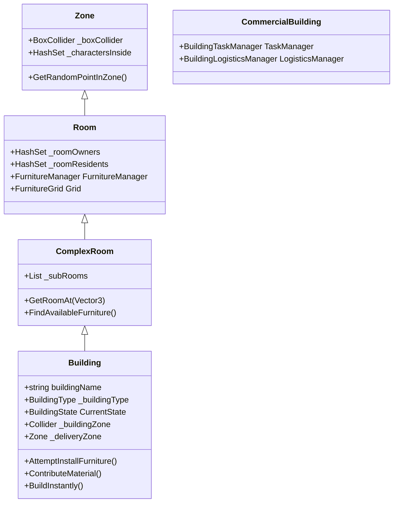

# Building & Zone Architecture

The building system in My-World-Isekai relies on a nested hierarchy of areas that define physical space, track character presence, and manage internal objects like furniture.

## Architectural Hierarchy

### 1. Zone (`Zone.cs`)
The foundational class for any demarcated area.
- **Physical Representation:** Requires a `BoxCollider` and `NavMeshModifierVolume`. 
- **Tracking:** Automatically tracks characters inside (`_charactersInside`) using `OnTriggerEnter` and `OnTriggerExit`.
- **Utility:** Can return random valid NavMesh points within its bounds.

### 2. Room (`Room.cs`)
An enclosed space within the game world.
- **Inheritance:** Inherits from `Zone`.
- **Ownership:** Tracks specific `Owners` and `Residents`.
- **Furniture Management:** Acts as the root for furniture, requiring a `FurnitureManager` and `FurnitureGrid` component. Uses its `BoxCollider` to initialize the bounds of the `FurnitureGrid`.

### 3. ComplexRoom (`ComplexRoom.cs`)
A room that contains smaller nested sub-rooms.
- **Composition:** Maintains a list of sub-`Room`s (`_subRooms`).
- **Recursive Logic:** Overrides character tracking, ownership, and furniture queries to check its own components as well as all nested sub-rooms.

### 4. Building (`Building.cs`)
The top-level structure in the world.
- **Inheritance**: Inherits from `ComplexRoom`. Sub-rooms typically act as the specific floors or separated areas of the building.
- **Management**: Registers itself globally with the `BuildingManager` on `Start()`.
- **Construction & States**: Buildings manage a native `CurrentState` (`BuildingState.UnderConstruction` or `Complete`). They can require `_constructionRequirements` (a list of `CraftingIngredient`s) to be placed. Players/NPCs populate this using `ContributeMaterial(ItemSO, amount)`, which triggers `OnConstructionComplete` when full. Alternatively, `BuildInstantly()` bypasses the requirements.
- **Logistics Integration**: Holds a reference to a `_deliveryZone` which is essential for the Logistics cycle.
- **Public access**: Has an outer `_buildingZone` (distinct from the main interior) for general traversal and random roaming around the property.
- **Dynamic Identity**: In dynamic city environments, buildings generate a unique `NetworkBuildingId` (GUID) on `OnNetworkSpawn`. This UUID is used to link the building to its specific interior map instance.
- **Prefab ID**: The `PrefabId` string is used for registry lookups in `WorldSettingsData` but is NOT unique per instance.

### 5. Commercial Building (`CommercialBuilding.cs`)
A specialized structural entity handling jobs and economic tasks.
- **Task Manager (`BuildingTaskManager`)**: Automatically attached module serving as a Blackboard. Manages a pool of `BuildingTask` objects. Instead of workers using expensive polling (raycasts/overlaps), tasks are registered here to be claimed sequentially using OCP-compliant logic (Open/Closed Principle) for dynamic behavior (e.g., Harvesters claiming trees).
- **Logistics Manager (`BuildingLogisticsManager`)**: Automatically attached **facade** over three plain-C# collaborators (`LogisticsOrderBook`, `LogisticsTransportDispatcher`, `LogisticsStockEvaluator`, all under `Assets/Scripts/World/Buildings/Logistics/`). The public API on the facade is stable — external callers (`JobLogisticsManager`, `InteractionPlaceOrder`, `GoapAction_PlaceOrder`, etc.) do not know about the split. Sub-components are reachable via `OrderBook`, `Dispatcher`, `Evaluator` properties for tests/tooling. See [`logistics-cycle` SKILL](../logistics_cycle/SKILL.md) for the order lifecycle, policy SO, and diagnostics details.
- **Stocking contract (`IStockProvider`)**: Any `CommercialBuilding` that wants autonomous restock implements `IStockProvider.GetStockTargets()`, returning `(ItemSO, MinStock)` pairs. The evaluator reads these on every `OnWorkerPunchIn` and places `BuyOrder`s when the virtual stock (physical + in-flight) falls below the pluggable `LogisticsPolicy`'s reorder threshold. Shipping implementers: `ShopBuilding` (projects `_itemsToSell`) and `CraftingBuilding` (`_inputStockTargets` — authored per-prefab in the Inspector, was added by the Layer A fix that stopped idle forges from sitting on empty input bins).

---

## The Furniture System

The interior of a `Room` is subdivided into a logical grid where objects can be placed.

### FurnitureGrid (`FurnitureGrid.cs`)
Provides a discrete coordinate system over a room's `BoxCollider`.
- **Initialization:** Determines grid bounds (`_gridWidth`, `_gridDepth`) using the room's collider size and a defined `_cellSize` (fixed at 1 unit = 1m).
- **Serialization:** Grid data (`_gridWidth`, `_gridDepth`, `_gridOrigin`, `_cells`) is serialized into the prefab via `[ContextMenu("Initialize Furniture Grid")]`. At runtime, `RestoreFromSerializedData()` rebuilds the 2D array from the flat list and recalculates cell world positions from the current transform (handles interior offset at y=5000).
- **Client sync:** On clients, `Awake()` fires before NGO sets the network position. `Room.OnNetworkSpawn()` calls `RestoreFromSerializedData()` again so the grid origin matches the actual runtime position. Without this, the grid is anchored at the prefab's origin (0,0,0) instead of the interior offset.
- **Placement Validation:** `CanPlaceFurniture()` checks: cell in bounds, not occupied, not IsWall, cell corners within BoxCollider bounds. The bounds Y-check uses `roomBounds.center.y` to avoid rejection by flat (height=0) colliders.
- **Ghost Snapping:** `GetPlacementPositions(cursorPos, sizeInCells)` returns grid-snapped anchor + visual center. Clamps the furniture footprint to grid bounds so it can't extend outside. The anchor is used for grid validation/registration, the visual center for ghost rendering.
- **Pathfinding:** Works alongside NavMesh but focuses purely on discrete object placement logic.

### Furniture registration / lazy bootstrap

`Room.Awake()` calls `FurnitureManager.LoadExistingFurniture()` to populate `Furnitures` from children. The scan uses `GetComponentsInChildren<Furniture>(true)` (includes inactive GameObjects). Because nested-prefab children can still be late-parented or late-activated — especially for network-spawned buildings where `NetworkObject` children arrive after the parent's Awake — `LoadExistingFurniture()` is **re-invoked in `Room.Start()` and `Room.OnNetworkSpawn()`**. The call is idempotent (replaces the list, `FurnitureGrid.RegisterFurniture` just reassigns `cell.Occupant`).

This bootstrap matters because `CraftingBuilding.GetCraftableItems()` walks `Rooms → FurnitureManager.Furnitures → station.CraftableItems`. If the list is empty, `ProducesItem(item)` returns false for every item and `LogisticsStockEvaluator.FindSupplierFor` can't route to the building. Any other system that queries a room's furniture at runtime depends on the same invariant.

### Furniture (`Furniture.cs`)
The base class for interactable or static objects inside rooms.
- **Space Occupation:** Holds a `_sizeInCells` (Vector2Int) dictating how many grid cells it consumes. This is often auto-calculated via renderer bounds.
- **Interaction Point:** Dictates where characters must stand to interact with it (`_interactionPoint`).
- **Availability State:** 
  - `_reservedBy`: A character is walking to it.
  - `_occupant`: A character is currently using it physically.
  - Both prevent other characters from using the furniture simultaneously.

### Furniture Placement & Pickup (Player + NPC)

Furniture has two forms:
- **Portable:** `FurnitureItemSO` (ScriptableObject in `Resources/Data/Item/`) + `FurnitureItemInstance` (carried in hands as a crate)
- **Installed:** `Furniture` MonoBehaviour (placed on grid or freestanding)

Bidirectional link: `FurnitureItemSO._installedFurniturePrefab` → Furniture prefab; `Furniture._furnitureItemSO` → back to `FurnitureItemSO`.

#### Placement Flow
- **Player:** Carries `FurnitureItemInstance` in hands → presses F → `FurniturePlacementManager` shows ghost → left-click confirms → queues `CharacterPlaceFurnitureAction`
- **NPC:** AI decision → queues `CharacterPlaceFurnitureAction(character, room, prefab)` directly
- **Action (shared):** `CharacterPlaceFurnitureAction.OnApplyEffect()` — calls `CharacterActions.RequestFurniturePlaceServerRpc()` to have the server instantiate + spawn + register on grid. Client-side: consumes item from hands (player path). NPC path (no FurnitureItemSO): direct server spawn.

#### Pickup Flow
- **Player:** Hold E on furniture → "Pick Up" option via `FurnitureInteractable.GetHoldInteractionOptions()` → queues `CharacterPickUpFurnitureAction`
- **NPC:** AI decision → queues `CharacterPickUpFurnitureAction(character, furniture)` directly
- **Action (shared):** `CharacterPickUpFurnitureAction.OnApplyEffect()` — creates `FurnitureItemInstance`, puts in hands, calls `CharacterActions.RequestFurniturePickUpServerRpc()` to have the server unregister from grid + despawn. Non-networked furniture: direct `Destroy()`.

#### Key Methods on FurnitureManager
- `AddFurniture(prefab, position)` — instantiates + registers (non-networked, NPC legacy)
- `RegisterSpawnedFurniture(furniture, position)` — registers already-spawned networked furniture (no instantiation)
- `UnregisterAndRemove(furniture)` — unregisters from grid + removes from list (no destroy, caller handles despawn)
- `RemoveFurniture(furniture)` — unregisters + destroys (non-networked legacy)

#### Debug Mode
`DebugScript` button calls `FurniturePlacementManager.StartPlacementDebug(FurnitureItemSO)` — bypasses carry requirement, enters ghost placement mode directly.

#### FurnitureGrid Editor Tools
- `[ContextMenu("Initialize Furniture Grid")]` — bakes grid data into prefab from BoxCollider + floor renderers
- `_floorRenderers` list — defines walkable floor planes for non-rectangular rooms (L-shapes, etc.)
- Cells over void (no floor) are marked `IsWall = true` and rejected by `CanPlaceFurniture()`
- Gizmo colors: green = free, red = occupied, gray = wall/no floor

## Best Practices
- Always ensure `Zone` colliders have `isTrigger = true` and perfectly encapsulate their interior visual meshes, as their size dictates the generated `FurnitureGrid`.
- Room BoxColliders must have **non-zero height** — flat colliders (height=0) cause `Bounds.Contains()` to reject valid grid cells.
- Query `Furniture` availability starting from the `ComplexRoom` or `Building` level to let recursive logic find the nearest or first-available furniture in the entire property.
- When an NPC needs to drop items off or use the shop, rely on the properties like `_deliveryZone` stored natively on the `Building` component.
- Player-placed furniture prefabs must have `NetworkObject`, `Furniture` (with `_furnitureItemSO`), and `FurnitureInteractable` components.
- All gameplay effects (place, pickup) go through `CharacterAction` — player HUD is UI-only, never spawns directly.
- **Network gotcha:** Any system that caches world positions in `Awake()` (like FurnitureGrid) must recalculate in `OnNetworkSpawn()` for clients, because NGO sets the network position after `Awake()`. Interior rooms at y=5000 are the primary case where this matters.

---

## Building Placement System

Player and NPC building placement follows a shared validation pipeline.

### Key Files
| File | Purpose |
|---|---|
| `BuildingPlacementManager.cs` | Ghost visual, mouse positioning, validation, `RequestPlacementServerRpc` |
| `UI_BuildingPlacementMenu.cs` | Lists unlocked blueprints, instant mode toggle |
| `UI_BuildingEntry.cs` | Single entry row: icon + name + click handler |
| `CharacterBlueprints.cs` | Stores `UnlockedBuildingIds` and `MaxPlacementRange` |
| `WorldSettingsData.cs` | `BuildingRegistry` (PrefabId → BuildingPrefab mapping) |

### Placement Flow (Player)
1. Player opens `UI_BuildingPlacementMenu` via the HUD "Build" button.
2. Selects a building → `BuildingPlacementManager.StartPlacement(prefabId)`.
3. Ghost prefab follows mouse cursor (raycast on `_groundLayer`).
4. Ghost material changes (valid = green, invalid = red) based on `ValidatePlacement()`.
5. **Left-Click** confirms → `RequestPlacementServerRpc` spawns the building server-side.
6. **Right-Click / Escape** cancels placement.

### Validation Rules
- **Range**: `Vector3.Distance(character, target) <= CharacterBlueprints.MaxPlacementRange`.
- **Obstacle overlap**: `Physics.OverlapBox` using the building's `BuildingZone` collider against `_obstacleLayer`.
- `ValidatePlacement(Vector3)` is **public** so NPC AI systems can call it directly.

### Instant Build Mode
- Toggled via `SetInstantMode(bool)` on `BuildingPlacementManager`.
- UI exposes this as a `Toggle` in the placement menu.
- When active, the ServerRpc calls `building.BuildInstantly()` after spawning, bypassing construction requirements.

### State Management & Interactions
Building mode is integrated into the core `Character` state machine to ensure consistency:
- **Character State**: `Character.IsBuilding` flag and `OnBuildingStateChanged` event.
- **Busy Logic**: When building, `Character.IsFree()` returns `false` with `CharacterBusyReason.Building`. This prevents overlapping actions (e.g. starting a craft while placing).
- **Auto-Interruption**: `BuildingPlacementManager` inherits from `CharacterSystem`. It automatically calls `CancelPlacement()` if the character enters combat or becomes incapacitated.
- **UI Sync**: `UI_BuildingPlacementMenu` subscribes to `OnBuildingStateChanged`. If the state is cancelled externally (combat), the menu automatically closes.

### Camera Integration
The camera system reacts to building state changes for improved UX:
- **Auto Zoom**: When a character enters building mode, `CameraFollow` smoothly zooms out to the maximum allowed distance (`_targetZoom = 1f`).
- **Scroll Lock**: Manual mouse wheel zoom is disabled during placement to prevent accidental perspective shifts.
- **Restore Zoom**: Upon exiting building mode (completion or cancellation), the camera restores the previous zoom level.

### Server Authority
- The ghost is client-local only (NetworkObject disabled on the ghost prefab).
- Actual building spawn happens exclusively on the Server via `RequestPlacementServerRpc`.
- The Server re-validates the prefab ID against `WorldSettingsData.BuildingRegistry` before instantiation.

## Building Interiors

Interiors use the **Spatial Offset Architecture** (placed at `y=5000` via `WorldOffsetAllocator.GetInteriorOffsetVector()`). They are **lazy-spawned** on first entry and **hibernate independently** when empty.

### Key Files
| File | Purpose |
|---|---|
| `BuildingInteriorDoor.cs` | Exterior entrance door (inherits `MapTransitionDoor : InteractableObject`) |
| `BuildingInteriorRegistry.cs` | Server singleton mapping BuildingId → InteriorRecord, ISaveable |
| `BuildingInteriorSpawner.cs` | Static helper that instantiates + configures interior prefabs |
| `CharacterMapTracker.cs` | Server-side lazy-spawn in `ResolveInteriorPosition()`, `WarpClientRpc` |
| `CharacterMapTransitionAction.cs` | Client-side fade + warp action, uses `ForceWarp` |
| `ScreenFadeManager.cs` | Client-only fade-to-black overlay (uses `Time.unscaledDeltaTime`) |

### 1. Linking Exterior to Interior
The connection is established via **`BuildingInteriorDoor.cs`** on the exterior building.
- **Auto-detection:** The door derives `BuildingId` and `PrefabId` from `GetComponentInParent<Building>()`. The `ExteriorMapId` is auto-detected from the interactor's `CurrentMapID`, a parent `MapController`, or falls back to `"World"`.
- **Deterministic ID:** Interior `MapId` = `"{ExteriorMapId}_Interior_{BuildingId}"`. Both client and server can compute this independently.
- **Lazy Spawning:** The interior is only spawned when the first player interacts with the door. The server handles this in `CharacterMapTracker.ResolveInteriorPosition()`.
- **Scene hierarchy:** After `netObj.Spawn(true)`, `BuildingInteriorSpawner` calls `MapController.GetByMapId(record.ExteriorMapId)` and `netObj.TrySetParent(exteriorMap.transform, worldPositionStays: true)` so the interior MapController becomes a child of its exterior in both server and client hierarchies. Valid because both are NetworkObjects — cross-NetworkObject parenting is NGO-safe. If `TrySetParent` fails, a warning is logged and the interior stays at scene root (still fully networked, just visually disconnected).

### 2. Interior Prefab Requirements
Every Interior Prefab root must contain:
- `MapController` (spawner sets `IsInteriorOffset = true` and `MapId` at runtime)
- `NetworkObject`
- `NavMeshSurface` (must be baked in the prefab relative to root)
- One or more `Room` components (for furniture placement)
- A plain `MapTransitionDoor` for the exit door (**NOT** `BuildingInteriorDoor`)
  - The exit door can have a `TargetSpawnPoint` in the prefab for editor preview, but `BuildingInteriorSpawner` **clears it at runtime** and uses `TargetPositionOffset` instead (computed as `exteriorReturnPos - exitDoor.transform.position`)

### 3. Transition Flow (Enter)
1. Player interacts with `BuildingInteriorDoor`.
2. Door computes `interiorMapId` and `targetPosition` (Vector3.zero on first visit, real position on repeat visits).
3. `CharacterMapTransitionAction.OnStart()` fades to black (`ScreenFadeManager`).
4. `OnApplyEffect()`: Client calls `ForceWarp` if position is known, then sends `RequestTransitionServerRpc`.
5. **Server** (`ResolveInteriorPosition`): On first visit, registers the interior in `BuildingInteriorRegistry`, spawns via `BuildingInteriorSpawner`, resolves the interior offset position.
6. If the server resolved a different position than the client sent, it sends `WarpClientRpc` back to the owning client.
7. `WarpClientRpc` calls `CharacterMovement.ForceWarp()` on the client (owner-authoritative via `ClientNetworkTransform`).

### 4. Transition Flow (Exit)
1. Player interacts with the plain `MapTransitionDoor` inside the interior.
2. `MapTransitionDoor.Interact()` computes `dest = transform.position + TargetPositionOffset` (which resolves to the exterior return position).
3. Same `CharacterMapTransitionAction` flow: fade, `ForceWarp`, `RequestTransitionServerRpc`.
4. Interior `MapController` hibernates when player count reaches 0.

### 5. ForceWarp (Cross-NavMesh Teleport)
`CharacterMovement.ForceWarp(Vector3)` is required for all interior transitions because the source and destination have separate NavMesh surfaces.
- Disables `NavMeshAgent` before teleporting (prevents snap-back to old NavMesh).
- Sets `transform.position` and `Rigidbody.position` directly.
- Sets Rigidbody to kinematic during teleport to prevent gravity interference.
- Re-enables the agent after **2 frames** (coroutine) so the destination NavMesh is ready.
- Regular `Warp()` must NOT be used for cross-map teleports — `NavMeshAgent.Warp` silently fails if the destination has no NavMesh.

### 6. Important Gotchas
- **FixedString size:** Map IDs use `FixedString128Bytes` (not 32) because interior IDs can be 50+ chars.
- **CharacterMovement location:** Use `_character.GetComponentInChildren<CharacterMovement>()`, not `TryGetComponent`, as it may be on a child GameObject.
- **ClientNetworkTransform:** Characters use owner-authoritative networking. The server cannot move the client — it must send `WarpClientRpc` for the client to move itself.
- **Exit door TargetSpawnPoint:** `BuildingInteriorSpawner` must null out any prefab-assigned `TargetSpawnPoint` on exit doors, otherwise it overrides the computed `TargetPositionOffset`.
- **Building.HasInterior / GetInteriorMap():** Helpers on `Building` to query the registry. Used by NPC systems to check if a building has a spawned interior.

### 7. BuildingInteriorRegistry (ISaveable)
- Singleton with `Dictionary<string, InteriorRecord>` keyed by `BuildingId`.
- `InteriorRecord`: `BuildingId`, `InteriorMapId`, `SlotIndex`, `ExteriorMapId`, `ExteriorDoorPosition`, `PrefabId`.
- On `RestoreState()`, respawns all interior MapControllers via `BuildingInteriorSpawner`.
- Allocates spatial slots via `WorldOffsetAllocator.AllocateSlotIndex()`.
- **Door persistence fields**: `InteriorRecord` includes `bool IsLocked = true` and `float DoorCurrentHealth = -1f` (negative = use prefab default). `BuildingInteriorSpawner` restores these after `NetworkObject.Spawn()`.

### 8. Door Lock / Door Health on Building Doors

Building doors (both `BuildingInteriorDoor` on the exterior and the exit `MapTransitionDoor` inside the interior) can have optional `DoorLock` and `DoorHealth` components. See the **door-lock-system** skill for full details.

**Key integration points:**
- **LockId auto-generation**: `DoorLock._lockId` must be **empty on building door prefabs**. At runtime, `DoorLock.OnNetworkSpawn()` auto-derives it from `GetComponentInParent<Building>().BuildingId` (unique GUID per building instance). This means same prefab, different lock per instance.
- **Interior exit door LockId**: Set by `BuildingInteriorSpawner` via `exitLock.SetLockId(record.BuildingId)` **before** `NetworkObject.Spawn()`, so both exterior and interior doors share the same LockId and auto-pair.
- **Paired door sync**: All doors with the same LockId are linked via a static registry. Lock/unlock/jiggle on one propagates to all paired doors.
- **No nested NetworkObjects**: `DoorLock` and `DoorHealth` sit on the door child GameObject but use the parent building's `NetworkObject`. **Never** add a separate `NetworkObject` to the door child.
- **IsSpawned guards**: All `NetworkVariable` reads and RPC calls on `DoorLock`/`DoorHealth` must be guarded with `doorLock.IsSpawned` to handle cases where the `NetworkObject` hasn't spawned yet.

---

## Building-Map Registration & Hibernation

> **STATUS: HIBERNATION DISABLED** — `MapController._hibernationEnabled` is `false` by default.
> The NPC/Building despawn-on-exit and respawn-on-enter system is fully implemented but disabled
> due to unresolved issues with NPC visual restoration (2D Animation bone corruption) and
> combat knockback falsely triggering OnTriggerExit → full hibernate cycle mid-fight.
> When re-enabling, ensure: (1) NPC identity/visual data is restored correctly from
> `HibernatedNPCData.RaceId/CharacterName/VisualSeed`, (2) a grace period prevents
> knockback-triggered hibernation, (3) Spine2D visual system is integrated.

Player-placed buildings are registered with the `MapController` they're placed inside, ensuring they survive map hibernation.

### Key Flow
1. **On placement** (`BuildingPlacementManager.RequestPlacementServerRpc` → `RegisterBuildingWithMap`):
   - `MapController.GetMapAtPosition(position)` tries the containing map.
   - **Bounds fallback** — iterates all exterior `MapController`s and tests `BoxCollider.bounds.Contains`.
   - **Must be inside a Region** — `ValidatePlacement` rejects out-of-Region clicks via `IsInsideRegion` (client ghost goes red + toast). Server re-validates in `RequestPlacementServerRpc` as authority.
   - **Expand nearby map** — if still no enclosing map, `MapRegistry.FindNearestMapInRegion(position)` returns the closest same-region exterior map within `WorldSettingsData.MapMinSeparation` (default 150 Unity units ≈ 23 m). If found → `MapController.ExpandBoundsToInclude(position, footprintSize, regionBounds)` grows that map's BoxCollider to envelop the new building, clamped to the Region's bounds. Building joins the expanded map.
   - **Create wild map** — if no nearby map either, `MapRegistry.CreateMapAtPosition(position)` spawns a new exterior MapController centered on the placement, then `MapController.ClampBoundsToRegion(regionBounds)` shrinks the new map to fit inside the Region. Registers a fresh `CommunityData` (Tier=Settlement, no leaders, no biome, MapId = `Wild_<guid8>`), allocates a `WorldOffsetAllocator` slot. **No rejection on MinSep** — it routes to expansion above.
   - Building is parented to the resolved MapController via `SetParent()`.
   - A `BuildingSaveData` entry is added to `CommunityData.ConstructedBuildings`.
   - `Building.PlacedByCharacterId` is set to the placing character's UUID.
2. **On hibernation** (`MapController.Hibernate()`): Buildings are synced to save data and despawned (matching the NPC pattern)
3. **On wake-up** (`MapController.WakeUp()`): Buildings are re-instantiated from `ConstructedBuildings`, with `BuildingId` restored (not regenerated) to prevent duplication
4. **Construction completion** (`Building.HandleStateChanged`): State is synced back to the matching `ConstructedBuildings` entry

### Known Issues (For When Re-Enabling)
- **NPC visual data**: `HibernatedNPCData` now saves `RaceId`, `CharacterName`, `VisualSeed` but restoration was untested with current 2D Animation system. Spine2D migration should fix bone deformation crashes.
- **Combat knockback**: Player can be knocked outside MapController trigger → OnTriggerExit → player count 0 → Hibernate fires mid-combat. Fix: add a 2-3s grace period in `CheckHibernationState` before calling `Hibernate()`.
- **Community auto-creation**: `EnsureCommunityData()` creates a CommunityData with no leaders for predefined maps. Permission check allows everyone to build when `LeaderIds.Count == 0`.
- **Predefined map OriginChunk**: Auto-created CommunityData now uses the map's actual world position for `OriginChunk` (not default `(0,0)`).

### `MapController.GetMapAtPosition(Vector3)`
Static utility that iterates `_mapRegistry`, skips interiors, returns the first map whose `_mapTrigger.bounds.Contains(position)`. Returns null for open world.

### `MapController.GetNearestExteriorMap(Vector3, float maxDistance)`
Static utility that iterates `_mapRegistry`, skips interiors, and returns the map whose trigger's `ClosestPoint(position)` is within `maxDistance`. Used by `BuildingPlacementManager` to "join" a nearby existing map before falling back to creating a new wild map.

### `MapRegistry.CreateMapAtPosition(Vector3)`
(`CommunityTracker` was renamed to `MapRegistry` in Phase 1 — ADR-0001.) Server-only. Instantiates the MapController prefab at `worldPosition`, allocates a unique MapId (`Wild_<guid8>`) + `WorldOffsetAllocator` slot, pre-registers a `CommunityData` (Tier=Settlement, no leaders, no biome, `IsPredefinedMap=false`), then spawns the `NetworkObject`. Returns the new MapController or null on failure. **Enforces `WorldSettingsData.MapMinSeparation`** — rejects if another `MapController` (exterior) or `WildernessZone` center is within the configured distance, returns null with a warning log. **Caveat:** `MapController.MapId` is a plain `string`, not a NetworkVariable — clients will not learn the MapId of dynamically spawned maps without a dedicated sync. Tracked as a broader follow-up; the wild-map path inherits this behavior.

### `BuildingSaveData.FromBuilding(Building, Vector3 mapCenter)`
Static factory creating a save entry with position **relative** to map center. Also captures:
- `OwnerCharacterIds` — `List<string>` from `Room.OwnerIds` (raw NetworkList read; works for both Residential and Commercial; preserves hibernated owners). Replaces the deprecated `OwnerNpcId` single-string field.
- `Employees` — `List<EmployeeSaveEntry>` (`CharacterId`, `JobType`) for CommercialBuilding crews. Iterates `commercial.Jobs` and emits one entry per assigned job.

`MapController.SnapshotActiveBuildings()` and `MapController.Hibernate()` always *replace* the dynamic fields (`OwnerCharacterIds`, `Employees`, `State`, `Position`, `Rotation`) on existing entries — do not patch fields individually or stale ownership leaks across saves.

### Building Ownership/Employee Restoration
`CommercialBuilding.RestoreFromSaveData(List<string> ownerIds, List<EmployeeSaveEntry> employees)` (server-only) is called by `MapController.SpawnSavedBuildings()` and `WakeUp()` immediately after `bNet.Spawn()` and `NetworkBuildingId` injection. It:

1. Tries to bind owner + every employee via `Character.FindByUUID`.
2. For unresolved entries, subscribes to `Character.OnCharacterSpawned` and retries on each spawn until empty (then unsubscribes).
3. Owner is bound through `SetOwner(owner, ownerJob, autoAssignJob: false)` — the new `autoAssignJob` flag suppresses SetOwner's auto-LogisticsManager pick so it doesn't steal a slot earmarked for a saved employee. The owner's saved job (if any) is fed in explicitly from the `Employees` list.
4. Employees go through `worker.CharacterJob.TakeJob(job, building)` so the bidirectional link (building.Jobs ↔ character._activeJobs) is consistent.

`OnNetworkDespawn` unsubscribes the listener — needed for re-hibernation cycles.

### `Building.PlacedByCharacterId`
`NetworkVariable<FixedString64Bytes>` tracking who originally placed the building. Distinct from `CommercialBuilding.Owner` (business operator). **Always restored** by `MapController.SpawnSavedBuildings()` / `WakeUp()` from `BuildingSaveData.PlacedByCharacterId` — early implementations dropped it on load.

### `BuildingManager.OnBuildingRegistered`
`static event Action<Building>` fired by `BuildingManager.RegisterBuilding`. Used by `CharacterJob` to lazily re-bind to a saved workplace when the building's map wakes up (event-driven; works for hibernated workplaces).

---

## Community Territory & Build Permits

### Leadership Model
- `CommunityData.LeaderIds`: `List<string>` of all leader character IDs (primary leader is first)
- `CommunityData.LeaderNpcId`: The primary leader (backward-compatible)
- `CommunityData.IsLeader(characterId)`: Checks if a character is any leader
- `CommunityData.AddLeader(characterId)`: Adds a leader, sets primary if first

### Placement Permissions
Buildings can only be placed inside a community zone by:
1. **Community leaders** (in `LeaderIds`) — always allowed
2. **Permit holders** — characters who obtained a `BuildPermit` from a leader

Non-leaders without a permit see a **red ghost** (placement denied). Open world has no restrictions.

### Build Permit System
- `BuildPermit`: `CharacterId`, `GrantedByLeaderId`, `RemainingPlacements`, `MapId`
- `CommunityData.GrantPermit()` / `HasPermit()` / `ConsumePermit()` methods
- Permits stack if granted multiple times
- Consumed on the server in `RequestPlacementServerRpc` after successful placement

### `InteractionRequestBuildPermit`
Extends `InteractionInvitation`. A non-leader asks a community leader for permission to build. NPC leaders evaluate based on relationship score. On acceptance, a `BuildPermit` is granted.

---

## Community Expansion & Building Adoption

`MapRegistry.AdoptExistingBuildings(MapController, CommunityData)` is the preserved API for discovering existing buildings inside a newly-created MapController's bounds (Phase 1 ADR-0001 removed its only caller — `PromoteToSettlement` — but the method remains for future wiring into `CreateMapAtPosition` when the placement landing lands near orphan buildings).

### Adoption Rules
- **Unowned buildings** (`PlacedByCharacterId` empty): Auto-claimed immediately
- **Owned buildings (owner present)**: Leader sends `InteractionNegotiateBuildingClaim` invitation
- **Owned buildings (owner absent)**: Queued as `PendingBuildingClaim` with 7-day timeout

### `InteractionNegotiateBuildingClaim`
Extends `InteractionInvitation`. Community leader negotiates with the building owner. NPC evaluation is relationship-based. On acceptance, building is parented to the MapController and added to `ConstructedBuildings`.

### Pending Building Claims
- `PendingBuildingClaim`: `BuildingId`, `OwnerCharacterId`, `DayClaimed`, `TimeoutDays`
- Processed daily in `MapRegistry.HandleNewDay()` (renamed from `CommunityTracker.HandleNewDay`)
- If owner returns: negotiation invitation triggered
- If timeout expires: auto-claimed into community
- `BuildingManager.FindBuildingById(id)` resolves live Building instances
