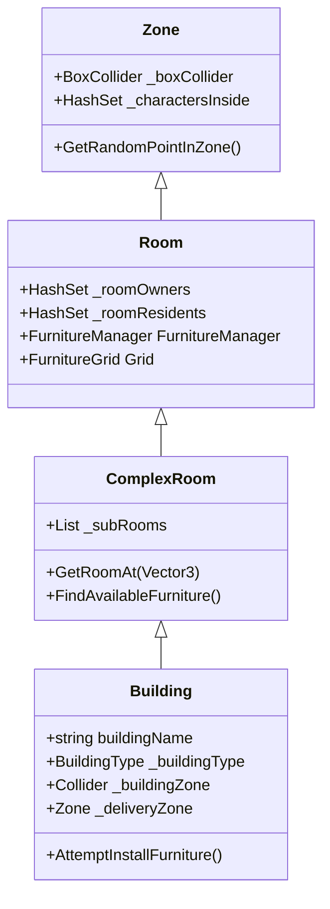

# Building & Zone Architecture

The building system in My-World-Isekai relies on a nested hierarchy of areas that define physical space, track character presence, and manage internal objects like furniture.

## Architectural Hierarchy

### 1. Zone (`Zone.cs`)
The foundational class for any demarcated area.
- **Physical Representation:** Requires a `BoxCollider` and `NavMeshModifierVolume`. 
- **Tracking:** Automatically tracks characters inside (`_charactersInside`) using `OnTriggerEnter` and `OnTriggerExit`.
- **Utility:** Can return random valid NavMesh points within its bounds.

### 2. Room (`Room.cs`)
An enclosed space within the game world.
- **Inheritance:** Inherits from `Zone`.
- **Ownership:** Tracks specific `Owners` and `Residents`.
- **Furniture Management:** Acts as the root for furniture, requiring a `FurnitureManager` and `FurnitureGrid` component. Uses its `BoxCollider` to initialize the bounds of the `FurnitureGrid`.

### 3. ComplexRoom (`ComplexRoom.cs`)
A room that contains smaller nested sub-rooms.
- **Composition:** Maintains a list of sub-`Room`s (`_subRooms`).
- **Recursive Logic:** Overrides character tracking, ownership, and furniture queries to check its own components as well as all nested sub-rooms.

### 4. Building (`Building.cs`)
The top-level structure in the world.
- **Inheritance:** Inherits from `ComplexRoom`. Sub-rooms typically act as the specific floors or separated areas of the building.
- **Management:** Registers itself globally with the `BuildingManager` on `Start()`.
- **Logistics Integration:** Holds a reference to a `_deliveryZone` which is essential for the Logistics cycle.
- **Public access:** Has an outer `_buildingZone` (distinct from the main interior) for general traversal and random roaming around the property.

---

## The Furniture System

The interior of a `Room` is subdivided into a logical grid where objects can be placed.

### FurnitureGrid (`FurnitureGrid.cs`)
Provides a discrete coordinate system over a room's `BoxCollider`.
- **Initialization:** Determines grid bounds (`_gridWidth`, `_gridDepth`) using the room's collider size and a defined `_cellSize` (typically 1 unit = 1m).
- **Placement Validation:** Checks collision boundaries using `CanPlaceFurniture()`. It verifies that points do not fall out of bounds or overlap with existing occupied cells.
- **Pathfinding:** Works alongside NavMesh but focuses purely on discrete object placement logic.

### Furniture (`Furniture.cs`)
The base class for interactable or static objects inside rooms.
- **Space Occupation:** Holds a `_sizeInCells` (Vector2Int) dictating how many grid cells it consumes. This is often auto-calculated via renderer bounds.
- **Interaction Point:** Dictates where characters must stand to interact with it (`_interactionPoint`).
- **Availability State:** 
  - `_reservedBy`: A character is walking to it.
  - `_occupant`: A character is currently using it physically.
  - Both prevent other characters from using the furniture simultaneously.

## Best Practices
- Always ensure `Zone` colliders have `isTrigger = true` and perfectly encapsulate their interior visual meshes, as their size dictates the generated `FurnitureGrid`.
- Query `Furniture` availability starting from the `ComplexRoom` or `Building` level to let recursive logic find the nearest or first-available furniture in the entire property.
- When an NPC needs to drop items off or use the shop, rely on the properties like `_deliveryZone` stored natively on the `Building` component.
